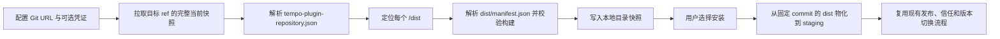
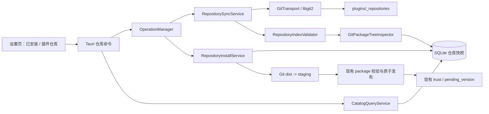
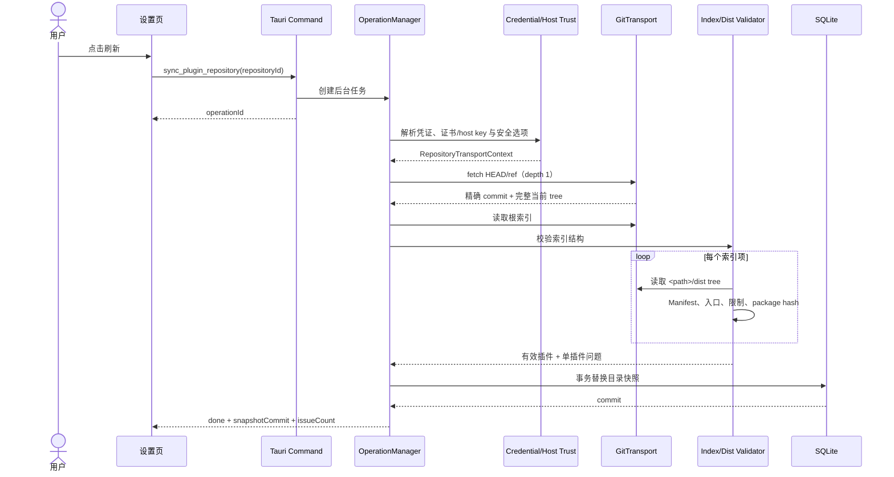
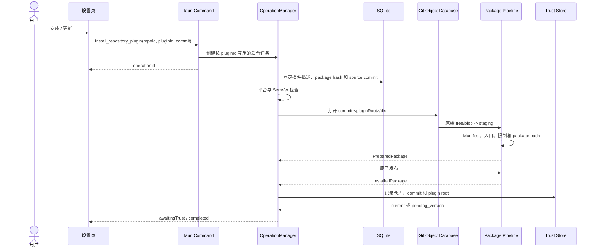

# Tempo 插件仓库功能详细设计

> 状态：实现中
>
> 设计日期：2026-08-26
>
> 目标版本：首个支持 Git 插件仓库的 Tempo 版本
>
> 本文定义实现方案；对应功能正在按本文分阶段落地。

## 1. 背景

Tempo 当前支持从本地目录或 ZIP 导入插件。安装包会经过 staging、路径与大小检查、Manifest 校验、整包哈希和原子发布；首次安装默认不信任且不启用，已启用插件的新版本先进入 `pending_version`，由用户信任后再切换。

插件仓库功能要在保留上述安全模型的前提下，为用户增加插件发现、安装和更新能力。仓库本身是一个 Git monorepo，可以是公开仓库，也可以是需要凭证的企业 GitLab 等内部仓库。拥有仓库写权限的贡献者可以直接提交插件源码、构建后的 `dist/` 以及索引变更。Tempo 将该 Git 仓库配置为插件源，完成认证、拉取仓库快照、解析索引，并直接从仓库中的 `dist/` 安装插件。

本设计不再使用“Git 索引指向外部 ZIP”的模型。插件源码、可安装构建和索引都位于同一个 Git 仓库中。

## 2. 核心模型

### 2.1 仓库维护流程


拥有仓库写权限的任何人都可以发布插件。仓库权限和仓库自身的 review/CI 规则是发布入口，Tempo 不维护另一套发布账号或中心服务。

### 2.2 Tempo 使用流程



Git 仓库每个索引项只提供插件 ID 和插件根目录。插件名称、版本、描述、发布者声明、平台、能力和贡献点均从该目录下的 `dist/manifest.json` 读取。

### 2.3 版本模型

- 每个仓库中的每个插件只暴露当前 `dist/` 构建。
- Git 历史不解析成可安装版本列表。
- 更新插件时必须提升 `dist/manifest.json` 的 SemVer 版本并提交新的 `dist/`。
- 删除索引项表示该插件不再由当前仓库提供；已经安装的插件不会被卸载。
- 同一版本的 `dist/` 内容不得修改。版本相同但 package hash 变化会被视为发布错误。

## 3. 目标与非目标

### 3.1 目标

1. 支持配置、启停、排序和删除多个公开或受保护 Git 仓库。
2. 支持拉取仓库当前源码快照，并在本地缓存上一次成功同步的目录。
3. 支持仓库贡献者以“源码 + `dist/` + 根索引”的方式提交插件。
4. 支持按关键词、分类和仓库筛选插件。
5. 支持从 Git commit 中的 `dist/` 安装插件并发现更新。
6. 仓库安装复用现有 staging、包校验、原子发布、信任和 pending version 机制。
7. 一个插件构建损坏时不阻止同一仓库中的其他正常插件更新。
8. 明确定义多仓库同 ID、同版本不同内容等冲突规则。
9. 同步和安装任务不绑定设置页或 WebView 生命周期。
10. 支持 HTTPS、显式确认后的 HTTP、SSH 和企业 GitLab 常用凭证。
11. PAT、密码和私钥口令不进入仓库 URL、SQLite、日志或前端持久化存储。

### 3.2 首版不做

- 外部 ZIP、GitHub Release 或对象存储安装包。
- `file://` 本地 Git 仓库；本地插件继续使用现有目录导入。
- 浏览器 OAuth、SAML/SSO 交互登录、Kerberos、客户端 TLS 证书。
- Tempo 托管或同步企业凭证；凭证只保存在本机。
- 在用户设备上运行 `npm install`、构建脚本或任何插件源码。
- Git submodule 初始化、Git LFS 下载、Git hooks 和自定义 smudge/clean filter。
- 仓库历史版本安装、版本回退和多版本并存目录。
- 发布者签名、仓库签名和 commit signature 强制验证。
- 自动安装更新或无确认切换版本。
- 插件依赖解析、评分、评论、付费和账号同步。

## 4. Git 仓库约定

### 4.1 推荐目录结构

```text
tempo-community-plugins/
  tempo-plugin-repository.json
  plugins/
    com.alice.notes/
      README.md
      package.json
      src/
      manifest.json                 开发源文件，可选
      dist/
        manifest.json               可安装 Manifest，必需
        index.html                  UI 插件入口，按 Manifest 要求
        assets/
    dev.bob.timer/
      README.md
      package.json
      src/
      dist/
        manifest.json
        main.mjs                    Runtime 插件入口，按 Manifest 要求
  .github/
    workflows/
      validate.yml                  推荐，由仓库维护者配置
  README.md
```

`plugins/<plugin-id>` 是推荐布局，但不是硬编码要求。索引中的 `path` 可以指向仓库内任意合法相对目录，以支持既有 monorepo 结构。

### 4.2 插件根目录与 dist

索引中的 `path` 指向插件根目录。Tempo 固定在其直接子目录 `dist/` 中寻找可安装插件，不允许为单个插件自定义 dist 名称。

`dist/` 必须满足：

1. `dist/manifest.json` 存在并通过当前 Manifest v1 校验。
2. Manifest ID 与索引项 ID 完全一致。
3. Manifest 中声明的 UI/Runtime 入口都在 `dist/` 内存在。
4. `dist/` 是独立可运行包，不依赖插件根目录中的 `src/`、根 `node_modules/` 或构建工具。
5. Runtime 依赖必须已打包进 `dist/`；Tempo 不执行包管理器安装。
6. 所有文件都必须已提交到 Git，不能依赖 ignored、untracked、submodule 或 LFS smudge 后的内容。
7. `dist/` 不得包含符号链接、Git submodule entry 或路径大小写冲突。
8. `dist/` 继续遵守现有 500 MiB、10,000 文件、单文件 200 MiB 等包限制。

插件根目录其他源码不会被执行，也不参与 package hash。即使根目录存在另一个 `manifest.json`，Tempo 也只认 `dist/manifest.json`。

该约定与现有 UI、Hybrid、Headless 模板一致：当前模板的 `pnpm build` 已经会把 Manifest 和对应 UI/Runtime 入口输出到 `dist/`，生成目录可以直接导入 Tempo，无需调整现有插件构建格式。

### 4.3 根索引示例

默认索引文件为仓库根目录的 `tempo-plugin-repository.json`：

```json
{
  "schemaVersion": 1,
  "id": "7c2f1a90-4b3e-4d8a-9c1b-2e5f6a7b8c9d",
  "description": "Community-maintained plugins for Tempo",
  "homepage": "https://example.com/tempo-community-plugins",
  "plugins": [
    {
      "id": "com.alice.notes",
      "path": "plugins/com.alice.notes"
    },
    {
      "id": "dev.bob.timer",
      "path": "plugins/dev.bob.timer"
    }
  ]
}
```

索引有意保持简单。仓库贡献者不需要在索引中重复填写版本、引擎、平台、能力、名称和描述，避免索引与 `dist/manifest.json` 产生两套元数据。

### 4.4 索引字段

顶层字段：

| 字段 | 必填 | 约束 | 说明 |
| --- | :---: | --- | --- |
| `schemaVersion` | 是 | 整数，首版只能是 `1` | 索引协议版本 |
| `id` | 是 | 小写 UUID；兼容旧的反向域名 ID | 仓库声明 ID，由 Tempo 自动生成，不作为本地主键 |
| `name` | 否 | 去除首尾空白后 1-128 字符 | 旧版显示名称；新仓库不再写入 |
| `description` | 否 | 最多 1024 字符 | 仓库说明 |
| `homepage` | 否 | 绝对 HTTP(S) URL，最多 2048 字符 | 仓库主页 |
| `plugins` | 是 | 数组，最多 5000 项 | 当前仓库提供的插件 |

插件索引项：

| 字段 | 必填 | 约束 | 说明 |
| --- | :---: | --- | --- |
| `id` | 是 | 与 Manifest 相同的插件 ID 规则 | 必须与 `dist/manifest.json` 一致 |
| `path` | 是 | 安全、规范化的仓库相对目录 | 插件根目录，Tempo 自动追加 `/dist` |

索引原始 JSON 最大 2 MiB。协议 v1 拒绝重复对象键和未知字段。插件 ID、规范化路径和不区分大小写后的路径都不得重复；插件根目录不得互相嵌套。

正式机器可读 Schema 放在 `docs/schemas/plugin-repository.schema.json`。Rust model、Schema、仓库 CI validator 和本文字段表必须使用同一组 fixture 做一致性测试。

### 4.5 路径规则

`path` 必须：

- 使用 `/` 分隔。
- 不是绝对路径且不以 `/` 开头。
- 不包含空段、`.`、`..`、反斜杠、NUL 或 Windows drive prefix。
- 不进入 `.git`。
- UTF-8 NFC 规范化后保持稳定。
- 在 Windows/macOS 不区分大小写检查下仍与其他插件路径唯一。

解析 `path/dist` 时同时执行词法 containment 和 Git tree traversal containment，不依赖字符串拼接后再猜测路径是否安全。

### 4.6 贡献者发布流程

1. clone 或 pull 仓库目标分支。
2. 在仓库内创建或修改一个插件根目录。
3. 在插件根目录完成开发构建，输出完整 `dist/`。
4. 确认 `dist/manifest.json` 的 ID、版本、引擎、平台、能力和入口正确。
5. 新插件在根索引增加 `{ id, path }`；已有插件保持同一索引项。
6. 版本更新必须提升 SemVer；不能只替换同版本 `dist/`。
7. 执行仓库 validator，检查索引、Manifest、入口、package hash、文件限制和跨平台路径。
8. 提交源码、`dist/` 和索引变更，然后 push 或发起 PR。

仓库维护者应使用 branch protection、CODEOWNERS 和 CI，但这些是仓库治理能力，不是 Tempo 客户端的身份认证。客户端始终独立校验 Git 中的 `dist/`。

## 5. 信任边界

### 5.1 仓库写权限就是发布权限

任何可以向目标 ref 写入内容的人，都可以：

- 新增索引项和插件。
- 更新已有插件的 `dist/`。
- 修改 Manifest 中的发布者声明、能力和运行代码。

因此用户添加仓库时，UI 必须明确提示：“该仓库的维护者可以向你提供插件和更新；安装后仍需单独信任插件。”

Tempo 不把 Git commit author、committer、Manifest `publisher` 或 `author` 当作已验证身份。这些字段只作声明文本展示。

### 5.2 两级信任

1. 添加仓库：允许该仓库的内容进入可浏览目录，不执行代码。
2. 信任插件包：复用现有 package hash 确认，之后才允许启用和运行。

仓库同步不会安装、信任、启用或运行插件。更新也只在用户明确操作后物化为新包；已启用插件仍通过 pending version 流程切换。

## 6. 现有能力与复用边界

| 现有模块 | 当前能力 | 本功能的处理 |
| --- | --- | --- |
| `src-tauri/src/plugins/package.rs` | 目录/ZIP staging、安全复制或解压、整包哈希、原子发布 | 抽取共享 package tree 校验；新增 Git tree 到 staging 的准备入口 |
| `src-tauri/src/plugins/manifest.rs` | Manifest v1、平台和贡献点校验 | `dist/manifest.json` 是目录元数据权威来源；补充仓库 SemVer 兼容检查 |
| `src-tauri/src/plugins/trust.rs` | 安装记录、信任、启停、`pending_version` | 保持当前语义；扩展 Git 仓库来源与 commit 字段 |
| `src-tauri/src/commands/plugins.rs` | 本地导入、插件列表、信任、切换、卸载 | 本地导入行为不变；仓库命令放入独立模块 |
| `src-tauri/src/plugins/paths.rs` | 插件包、数据、staging、trash 的统一路径 | Git 对象缓存继续放在统一插件存储根目录 |
| `PluginSettingsSection.tsx` | 已安装插件管理和本地导入 | 调整为“已安装 / 插件仓库”标签页，保留本地导入入口 |

仓库安装不得把 `dist/` 直接复制到 `plugins/packages`，不得绕过 staging 和现有发布冲突检查。

## 7. 总体架构



### 7.1 后端模块

建议新增：

```text
src-tauri/src/plugins/repository/
  mod.rs              对外服务与共享常量
  models.rs           索引、数据库和命令 DTO
  git.rs              bare 仓库、fetch、ref/commit/tree/blob 读取
  transport.rs        HTTP(S)/SSH transport、回调、证书与 host key 校验
  credentials.rs      凭证档案、系统凭证库和会话秘密
  index.rs            根索引解析和结构校验
  package_tree.rs     dist tree 检查、Manifest 读取和规范化 package hash
  compatibility.rs    平台与 SemVer 兼容性、更新判断
  store.rs            SQLite 读写与快照事务
  sync.rs             单仓库和全部仓库同步编排
  install.rs          commit/path 固定、staging 物化、发布和安装记录
  operations.rs       后台任务、互斥、取消、状态和事件

src-tauri/src/commands/plugin_repositories.rs
```

前端建议新增：

```text
src/builtin-plugins/settings/pages/plugin-repositories/
  PluginRepositoryPage.tsx
  RepositoryPluginList.tsx
  RepositoryPluginDetail.tsx
  RepositoryManagerDialog.tsx
  RepositoryOperationStatus.tsx
```

## 8. Git 拉取与本地缓存

### 8.1 Git 实现

- 不调用系统 `git` 或 `ssh` 命令，不要求用户安装 Git/OpenSSH。
- Rust 使用嵌入式 `git2/libgit2` 完成 HTTP(S)、SSH、凭证回调、fetch、ref 解析和对象树读取。
- 选择 `git2` 而不是原设计中的 `gix`，原因是首版需要同时覆盖 GitLab PAT/密码、SSH Agent、SSH 私钥、SSH host key、TLS 证书、代理、传输进度和取消回调。
- 支持 `https://`、`http://`、`ssh://`，并将 `git@host:group/repository.git` 等 SCP 风格地址规范化为 SSH 配置。
- 默认跟随远端 `HEAD`；高级配置允许 `refs/heads/*` 或 `refs/tags/*`。
- 使用 shallow depth 1 获取目标 ref 的当前 commit，不主动拉取完整历史。
- 不使用 partial clone 的 blob filter：目标 commit 的完整源码和 `dist/` blob 都进入本地 Git 对象库。
- 本地使用 bare/object database，不执行 checkout、hook、filter、submodule 或 LFS。
- 源码已随目标 commit 拉取，但 Tempo 只解析根索引和索引项对应的 `dist/`；其他源码对象不执行、不解析。
- 成功同步、目录记录和安装来源始终保存精确 commit ID，而不是只保存 branch 名。

这种实现满足“拉取整个仓库当前源码快照”，同时避免把任意仓库内容物化成可执行工作区。安装时只把已校验的 `dist/` tree 写入 staging。

所有 libgit2 回调由单个 `RepositoryTransportContext` 提供，负责凭证、证书/host key、代理、取消和 `transfer_progress.received_bytes` 限额。任何 transport 都不能绕过该上下文。

实施阶段必须先在 Windows/macOS 验证 vendored libgit2、TLS backend、libssh2 和 SSH Agent 行为，再冻结依赖 feature。构建差异不能通过回退到系统命令解决。

### 8.2 缓存布局

```text
<Tempo storage>/plugins/
  packages/                         现有已安装包
  data/                             现有插件数据
  _staging/                         现有包准备目录
  _trash/                           现有卸载回收目录
  _repositories/
    <repository-id>/
      git/                          bare/object database，包含当前源码快照
      assets/
        <snapshot-commit>/          目录页图标缓存
```

不再需要 `_downloads`。安装只从本地 Git commit 读取 `dist/`。

清理规则：

- 新增路径统一由 `plugins/paths.rs` 生成。
- 删除仓库时删除其 Git 和图标缓存，不删除已经安装的插件包或数据。
- 当前目录快照引用的 commit 不能被 prune。
- 同步与安装通过 per-repository 读写锁协调；安装物化旧 commit 时同步不能清理该 commit。
- Git 缓存超过 2 GiB 时显示警告并在下一次同步重建 depth 1 缓存。
- 新快照完成后只保留当前 commit 的图标缓存；活动安装引用的旧资源延迟清理。

### 8.3 传输和仓库限制

| 项目 | 首版限制 |
| --- | ---: |
| 单次 Git fetch 总耗时 | 5 分钟 |
| 连接超时 | 15 秒 |
| Git 传输字节硬上限 | 1 GiB |
| Git 当前快照 tree entry | 200,000 |
| 本地单仓库缓存警告阈值 | 2 GiB |
| 根索引 blob | 2 MiB |
| 索引插件数 | 5,000 |
| 单插件 dist 解包后总量 | 500 MiB |
| 单插件 dist 文件数 | 10,000 |
| 单插件 dist 单文件 | 200 MiB |

插件 monorepo 应避免把大型生成物、测试数据和媒体历史长期累积在目标分支。depth 1 只减少历史，不减少当前源码快照大小。

### 8.4 协议与认证矩阵

| 连接方式 | 首版认证 | 安全要求 |
| --- | --- | --- |
| `https://` | 匿名、用户名 + PAT/密码 | 使用系统证书信任或用户确认的证书 pin |
| `http://` | 匿名、用户名 + PAT/密码 | 必须显式允许不安全传输；发送凭证需额外确认 |
| `ssh://` | SSH Agent、私钥文件 + 可选口令 | 必须验证 SSH host key |
| SCP 风格 SSH | SSH Agent、私钥文件 + 可选口令 | 先规范化为 host、port、username、path，再验证 host key |

GitLab PAT 通过 libgit2 的 username/password credential 回调发送。不同 GitLab 配置对用户名要求不同，因此凭证档案同时保存非秘密 username 和秘密 token；UI 不硬编码 `oauth2` 等用户名。

首版不支持把 Token 写进 URL。HTTP(S) URL 中出现 password、PAT 或 userinfo 时拒绝保存，并引导用户创建凭证档案。SSH URL/SCP 地址中的 `user@host` 只作为 SSH username，不视为秘密。

### 8.5 凭证档案

凭证与仓库分离，允许同一个规范化 origin 下的多个仓库引用同一个企业 GitLab 凭证。凭证档案绑定精确 scheme、host 和 port；仓库选择器只显示作用域匹配的档案。支持：

```text
none                 匿名访问
http-token           username + PAT/密码
ssh-agent            username + SSH Agent
ssh-key              username + 私钥文件路径 + 可选口令
```

持久凭证：

- PAT、密码和私钥口令存入 Windows Credential Manager 或 macOS Keychain。
- Rust 侧通过系统凭证库封装（优先 `keyring` crate）访问秘密，并用 `secrecy`/`zeroize` 管理内存副本。
- 系统凭证库 service 固定为 `Tempo.PluginRepository`，account 使用随机 credential profile ID。
- SQLite 只保存档案 ID、类型、显示名、username、私钥路径和系统凭证库 locator，不保存秘密。
- SSH 私钥本体默认保留在用户选择的原文件中，不复制进数据库或普通应用数据目录。
- 删除凭证档案时先检查引用它的仓库；确认后删除系统凭证库条目并让这些仓库进入“缺少凭证”状态。

临时凭证：

- 用户可以选择“仅本次使用”。
- 秘密只进入 Rust managed state 的会话内存，应用退出即清除。
- 前端 state 在命令提交后立即清空，不写 `localStorage`、设置 JSON 或日志。
- 内存秘密使用 `secrecy`/`zeroize` 包装，使用完成后尽快清零。

凭证只能发送给其档案绑定的精确 scheme/host/port。HTTP(S) 跳转到另一 origin 时不得转发 Authorization，也不能自动复用 SSH 凭证。

### 8.6 TLS 证书与 SSH host key

HTTPS 默认使用系统证书信任。企业 GitLab 使用企业 CA 时，推荐由管理员把 CA 安装到系统信任库。对于无法修改系统信任库的场景，允许用户在连接测试中确认并 pin 当前服务器证书 SHA-256 指纹：

- pin 绑定精确 host + port。
- 证书变化时停止同步并返回 `TLS_CERTIFICATE_CHANGED`，不能静默接受新证书。
- UI 同时显示证书 subject、issuer、有效期和 SHA-256 指纹。

SSH 使用系统 `known_hosts` 作为已知 host key 来源，并维护 Tempo 自身确认的 host key 表。首次遇到未知 key 时，连接测试返回 key 类型和 SHA-256 指纹，由用户确认后保存。已知 host 的 key 发生变化时返回高优先级 `SSH_HOST_KEY_CHANGED`，不提供一键忽略并继续。

### 8.7 凭证获取流程

1. 用户输入仓库 URL，Tempo 解析协议、host、port 和可选 username。
2. 用户选择匿名、已有凭证档案或“新建凭证”。
3. `test_plugin_repository_connection` 使用所选档案执行 `ls-remote`/ref 探测，不写目录快照。
4. 若需要证书或 SSH host key 确认，UI 展示指纹，用户确认后重试。
5. 认证成功后标记连接已验证并启动首次同步。
6. 用户可以在离线时“保存但暂不验证”；该配置不自动同步，恢复网络后再执行连接测试。
7. 凭证过期或撤销时同步返回 `GIT_AUTH_FAILED`，旧目录快照继续可浏览。

后台自动刷新不会弹出凭证输入框。没有持久或会话凭证时只标记“需要凭证”，由用户打开仓库管理后重新授权。

## 9. 仓库同步

### 9.1 同步时序



### 9.2 详细步骤

1. 校验仓库 URL、协议安全确认、凭证状态、ref 和 index path。
2. 获取该仓库同步互斥锁；已有同步时返回现有 operation。
3. 初始化或打开 bare Git 缓存。
4. shallow fetch 目标 ref 并解析精确 commit。
5. 从 commit tree 读取根索引 blob，不 checkout。
6. 执行索引大小、Schema、重复 ID、重复/嵌套路径和字符串限制校验。
7. 对每个索引项解析 `<path>/dist` tree。
8. 读取并解析 `dist/manifest.json`，校验 ID、SemVer、引擎、平台、入口和贡献点。
9. 遍历 dist tree，拒绝符号链接、submodule、LFS pointer、大小写冲突和超限内容。
10. 按现有 package hash 规范对 Git tree 中的相对路径和 blob 字节计算哈希。
11. 读取目录图标；沿用现有优先选择首个 app/action icon 的规则，限制 256 KiB。
12. 比较该仓库上一次快照，识别版本回退和同版本内容变化。
13. 在一个 SQLite 事务中写入有效插件、问题列表、仓库元数据和 snapshot commit。
14. 发出完成事件；Git 或索引结构失败时保留整个旧快照。

### 9.3 单插件错误隔离

公开协作仓库中，一个贡献者提交错误不应让整个仓库不可用。错误分两级处理：

仓库级错误，整次同步失败并保留旧快照：

- Git fetch/ref 失败。
- 根索引不存在、JSON 无法解析或 Schema 版本不支持。
- 索引存在重复 ID、重复/嵌套路径等无法确定所有权的结构冲突。
- 数据库事务失败。

插件级错误，接受新 commit，但该插件不进入可安装目录，同时记录 issue：

- 插件根目录或 `dist/` 不存在。
- Manifest 无效或 ID 与索引不一致。
- 入口缺失、包含符号链接/submodule/LFS pointer 或超过包限制。
- version/engine requirement 不是合法 SemVer。
- 与上一快照相比版本降低。
- 版本未变化但 package hash 变化。

如果先前有效的插件在新 commit 中变为无效，它会从可安装目录移除并出现在仓库问题列表中。Tempo 不继续把旧构建伪装成新 commit 的内容；已经安装的本地包不受影响。

### 9.4 自动刷新

首版以手动刷新为主。打开“插件仓库”页时：

- 立即展示本地快照，不等待网络。
- 对已启用且 `last_success_at` 超过 6 小时的仓库启动后台同步。
- 同一应用会话每个仓库最多触发一次页面自动刷新。
- 同步失败只显示非阻塞状态，不清空缓存目录。

不在后台定时唤醒应用，不自动安装插件。

## 10. Package tree 校验与哈希

### 10.1 共享校验核心

当前本地目录和 ZIP 安装最终都进入 staging 后校验。Git 仓库需要在同步阶段直接检查 Git tree，并在安装阶段把 tree 物化到 staging。

将 `package.rs` 中与输入形式无关的规则抽成共享核心：

```text
PackageEntry
  relative_path
  entry_kind
  uncompressed_size
  content_reader

validate_package_entries(entries)
compute_canonical_package_hash(entries)
validate_manifest_and_entries(manifest, entries)
```

输入适配器：

- 本地目录：filesystem entries。
- ZIP：archive entries。
- Git 仓库：commit tree entries 和 blob reader。

共享核心负责路径规范化、重复/大小写冲突、文件数、大小、符号链接、Manifest、入口和 canonical hash。输入适配器仍负责自身特有的边界，例如 ZIP 压缩大小和 Git tree mode。

### 10.2 Git tree 特殊规则

- 普通 blob 可以成为 dist 文件。
- tree 可以成为目录。
- Git mode `120000`（symlink）在 dist 内拒绝。
- Git mode `160000`（submodule/gitlink）在 dist 内拒绝。
- 不应用 `.gitattributes` filter、line-ending conversion 或 executable transform，hash 和 staging 都使用 Git blob 原始字节。
- 检测 Git LFS pointer 文本并拒绝，避免把 pointer 文件当成真实资源安装。
- Git tree 路径先按字节和 UTF-8 规则检查，再转换为宿主文件路径。

### 10.3 Hash 语义

package hash 继续使用 Tempo 当前规范化算法，覆盖 dist 中所有文件的规范化相对路径和文件内容。它用于：

- 检测 Git 缓存内容在同步和安装之间是否变化。
- 检测同版本内容被替换。
- 比较不同仓库中的同 ID/同版本构建。
- 复用现有信任和运行前完整性检查。

Git commit ID 负责标识仓库快照，package hash 负责标识一个插件的 `dist/`。两者都不等于发布者身份签名。

## 11. 兼容性与多仓库选择

### 11.1 兼容性

- Tempo 产品版本：Rust `env!("CARGO_PKG_VERSION")`。
- Plugin API 版本：`plugins::bridge::HOST_API_VERSION`。
- 平台：复用 `manifest::current_host_platform()`。

仓库插件比本地导入执行更严格的版本检查：

1. `manifest.version` 必须是合法 SemVer。
2. `engines.tempo` 和 `engines.pluginApi` 必须能被 `semver::VersionReq` 解析。
3. 当前平台必须在 `platforms` 中，空数组继续表示全部受支持平台。
4. 当前 Tempo 和 Plugin API 版本必须满足对应 requirement。

同步可保存不兼容插件的元数据，目录显示具体原因，但安装命令必须再次检查并拒绝。

### 11.2 多仓库规则

1. 插件 ID 在 Tempo 安装空间内全局唯一。
2. 仓库 priority 数值越小，优先级越高。
3. 未安装插件默认展示优先级最高的有效来源，其他来源列在详情中。
4. 已从仓库安装的插件固定跟随其原始仓库检查更新；调整优先级不会自动换源。
5. 同一 `插件 ID + 版本 + package hash` 视为相同构建，可去重。
6. 同一 `插件 ID + 版本` 但 package hash 不同，标记为构建冲突，禁止覆盖和自动换源。
7. 删除或禁用来源后停止更新；已安装插件和数据不删除。
8. 用户可以显式选择其他来源，Tempo 必须显示换源提示并重新执行信任流程。

### 11.3 更新判断

每个仓库只提供一个当前构建：

1. 读取已安装当前版本的 `source_repository_id`。
2. 在对应仓库当前快照查找相同插件 ID。
3. 解析双方 SemVer。
4. 仓库版本严格大于当前版本且兼容时显示更新。
5. 相同版本相同 hash 视为已安装。
6. 相同版本不同 hash 显示发布冲突。
7. 仓库版本低于当前版本不提供降级操作。

本地导入插件默认不绑定仓库。用户显式从仓库安装同 ID 构建后，才记录新的固定来源。

## 12. 数据库设计

### 12.1 DDL

```sql
CREATE TABLE IF NOT EXISTS plugin_repository_credentials (
    id TEXT PRIMARY KEY,
    display_name TEXT NOT NULL,
    scope_scheme TEXT NOT NULL CHECK (
        scope_scheme IN ('https', 'http', 'ssh')
    ),
    scope_host TEXT NOT NULL,
    scope_port INTEGER NOT NULL,
    auth_kind TEXT NOT NULL CHECK (
        auth_kind IN ('http-token', 'ssh-agent', 'ssh-key')
    ),
    username TEXT,
    ssh_private_key_path TEXT,
    secret_storage TEXT NOT NULL CHECK (
        secret_storage IN ('none', 'keyring', 'session')
    ),
    secret_locator TEXT,
    created_at TEXT NOT NULL,
    updated_at TEXT NOT NULL
);

CREATE TABLE IF NOT EXISTS plugin_repositories (
    id TEXT PRIMARY KEY,
    url TEXT NOT NULL,
    git_ref TEXT NOT NULL DEFAULT 'HEAD',
    index_path TEXT NOT NULL DEFAULT 'tempo-plugin-repository.json',
    authentication_mode TEXT NOT NULL DEFAULT 'anonymous'
        CHECK (authentication_mode IN ('anonymous', 'credential')),
    credential_id TEXT,
    allow_insecure_transport INTEGER NOT NULL DEFAULT 0
        CHECK (allow_insecure_transport IN (0, 1)),
    allow_insecure_credentials INTEGER NOT NULL DEFAULT 0
        CHECK (allow_insecure_credentials IN (0, 1)),
    tls_policy TEXT NOT NULL DEFAULT 'system'
        CHECK (tls_policy IN ('system', 'pinned-certificate')),
    proxy_mode TEXT NOT NULL DEFAULT 'system'
        CHECK (proxy_mode IN ('system', 'none')),
    display_name TEXT,
    remote_repository_id TEXT,
    remote_name TEXT,
    remote_description TEXT,
    remote_homepage TEXT,
    enabled INTEGER NOT NULL DEFAULT 1 CHECK (enabled IN (0, 1)),
    priority INTEGER NOT NULL,
    snapshot_commit TEXT,
    snapshot_catalog_hash TEXT,
    valid_plugin_count INTEGER NOT NULL DEFAULT 0,
    issue_count INTEGER NOT NULL DEFAULT 0,
    connection_verified_at TEXT,
    last_sync_at TEXT,
    last_success_at TEXT,
    last_error_code TEXT,
    last_error_message TEXT,
    created_at TEXT NOT NULL,
    updated_at TEXT NOT NULL,
    UNIQUE (url, git_ref, index_path),
    FOREIGN KEY (credential_id)
        REFERENCES plugin_repository_credentials(id) ON DELETE SET NULL
);

CREATE TABLE IF NOT EXISTS plugin_repository_tls_pins (
    host TEXT NOT NULL,
    port INTEGER NOT NULL,
    fingerprint_sha256 TEXT NOT NULL,
    subject TEXT,
    issuer TEXT,
    not_after TEXT,
    trusted_at TEXT NOT NULL,
    PRIMARY KEY (host, port)
);

CREATE TABLE IF NOT EXISTS plugin_repository_ssh_host_keys (
    host TEXT NOT NULL,
    port INTEGER NOT NULL,
    key_type TEXT NOT NULL,
    fingerprint_sha256 TEXT NOT NULL,
    trusted_at TEXT NOT NULL,
    last_seen_at TEXT NOT NULL,
    PRIMARY KEY (host, port, key_type, fingerprint_sha256)
);

CREATE TABLE IF NOT EXISTS plugin_repository_plugins (
    repository_id TEXT NOT NULL,
    plugin_id TEXT NOT NULL,
    plugin_root TEXT NOT NULL,
    version TEXT NOT NULL,
    package_hash TEXT NOT NULL,
    name TEXT NOT NULL,
    publisher TEXT,
    author TEXT,
    description TEXT,
    homepage TEXT,
    license TEXT,
    kind TEXT NOT NULL,
    categories_json TEXT NOT NULL DEFAULT '[]',
    platforms_json TEXT NOT NULL DEFAULT '[]',
    capabilities_json TEXT NOT NULL DEFAULT '[]',
    engine_tempo TEXT NOT NULL,
    engine_plugin_api TEXT NOT NULL,
    requires_node_runtime INTEGER NOT NULL DEFAULT 0,
    icon_cache_key TEXT,
    source_commit TEXT NOT NULL,
    indexed_at TEXT NOT NULL,
    PRIMARY KEY (repository_id, plugin_id),
    FOREIGN KEY (repository_id)
        REFERENCES plugin_repositories(id) ON DELETE CASCADE
);

CREATE TABLE IF NOT EXISTS plugin_repository_issues (
    repository_id TEXT NOT NULL,
    entry_key TEXT NOT NULL,
    declared_plugin_id TEXT,
    plugin_root TEXT,
    error_code TEXT NOT NULL,
    error_message TEXT NOT NULL,
    source_commit TEXT NOT NULL,
    created_at TEXT NOT NULL,
    PRIMARY KEY (repository_id, entry_key),
    FOREIGN KEY (repository_id)
        REFERENCES plugin_repositories(id) ON DELETE CASCADE
);

CREATE INDEX IF NOT EXISTS idx_plugin_repositories_priority
    ON plugin_repositories(enabled, priority, id);

CREATE INDEX IF NOT EXISTS idx_repository_plugins_plugin_id
    ON plugin_repository_plugins(plugin_id, repository_id);

CREATE INDEX IF NOT EXISTS idx_repository_plugins_name
    ON plugin_repository_plugins(name, plugin_id);
```

扩展现有 `plugin_versions`：

```sql
ALTER TABLE plugin_versions ADD COLUMN source_repository_id TEXT;
ALTER TABLE plugin_versions ADD COLUMN source_commit TEXT;
ALTER TABLE plugin_versions ADD COLUMN source_plugin_root TEXT;
```

`source_repository_id` 不设置外键。仓库删除后需要保留安装来源快照。`install_source` 同时写为 `repository:<repository_id>`；本地导入仍写 `local`，三个新字段为 `NULL`。

### 12.2 主键

`plugin_repositories.id` 是 Tempo 本地生成的 UUID，不使用索引中的仓库 ID。首次同步前还不知道远端声明 ID，且两个 URL 可能错误地声明相同 ID，本地配置不能互相覆盖。

### 12.3 快照事务

索引结构有效后，一次同步在单个事务中：

1. 删除该仓库旧的有效插件和 issue 行。
2. 插入当前 commit 的有效插件。
3. 插入当前 commit 的插件级 issue。
4. 更新远端元数据、snapshot commit、catalog hash、计数和成功时间。
5. 提交事务。

Git fetch、tree 遍历和 package hash 均在事务外完成。仓库级失败只更新 `last_sync_at` 和错误字段，不替换旧快照。

### 12.4 迁移

1. 在数据库初始化 DDL 中加入新表和索引。
2. 提供幂等 `ensure_plugin_repository_tables`。
3. 沿用当前 `PRAGMA table_info` 方式扩展 `plugin_versions`。
4. 系统凭证库没有数据库迁移；首次保存秘密时按 credential profile ID 创建条目。
5. 不为现有本地插件推断仓库来源。
6. 首次升级后仓库列表为空；官方仓库 URL 由明确产品配置注入，不在设计中虚构地址。
7. 仓库或凭证元数据迁移失败不影响现有插件加载和本地导入。

## 13. 安装与更新流程

### 13.1 安装时序



### 13.2 包准备重构

将现有包管道明确拆成准备与发布两阶段：

```text
prepare_directory(app, source) -> PreparedPackage
prepare_zip(app, source) -> PreparedPackage
prepare_git_tree(app, repository, commit, dist_tree) -> PreparedPackage

publish_prepared(app, PreparedPackage) -> InstalledPackage
```

所有 prepare 最终产生受控 staging，并调用同一套 Manifest、入口和 hash 校验。`PreparedPackage` 未发布时负责清理 staging；publish 后转移所有权。

现有 `import_directory` 和 `import_zip` 改为 prepare + publish，对外行为不变。Git prepare 只增加输入适配器，不增加第二套发布逻辑。

### 13.3 详细步骤

1. 从当前 SQLite 快照复制不可变 `RepositoryPluginDescriptor`：仓库 ID、commit、plugin root、ID、版本和 package hash。
2. 如果 UI 提供的 expected commit 与当前快照不同，返回 `CATALOG_CHANGED`，要求刷新详情。
3. 再次检查平台、Tempo 版本和 Plugin API 版本。
4. 获取按插件 ID 的安装互斥锁和仓库 snapshot read lease。
5. 从 Git ODB 打开精确 commit 下的 `<pluginRoot>/dist` tree。
6. 将普通 blob 原始字节写入新的 staging；拒绝 symlink、submodule、LFS pointer 和超限内容。
7. 从 staging 解析 Manifest，确认 ID、版本、引擎、平台和能力与目录快照一致。
8. 重新计算 package hash，必须等于同步时记录的 hash。
9. 调用 `publish_prepared` 原子发布。
10. 在数据库事务中扩展调用 `record_installed_version`，写入 `repository:<id>`、source repository、commit 和 plugin root。
11. 首次安装保持禁用且不信任。
12. 已启用插件更新保持当前版本运行，新版本进入 `pending_version`。
13. 用户确认信任后复用现有 pending version 切换。

安装阶段不访问远程网络。若本地 Git commit 缺失或损坏，返回 `SOURCE_SNAPSHOT_MISSING` 并要求重新同步，不临时从未经目录校验的新 commit 安装。

### 13.4 幂等与冲突

- 目标 ID/版本不存在：正常发布。
- 目标 ID/版本已存在且 hash 相同：不重复复制，安装记录可显式绑定当前仓库来源。
- 目标 ID/版本已存在但 hash 不同：返回 `VERSION_BUILD_CONFLICT`，不得覆盖。
- 仓库版本低于已安装版本：拒绝，首版不支持降级。
- 已有 pending version：同一目标 hash 返回已有状态，其他版本需先处理当前 pending。

### 13.5 文件发布后数据库失败

文件发布和 SQLite 无法组成单一事务。数据库写入失败时：

- 如果目录是本次新发布且不是 current/pending，移动到 `_trash`。
- 如果目标目录此前已存在且 hash 相同，不删除已有目录。
- 当前运行版本永远不参与失败补偿删除。
- 补偿失败记录诊断日志，由启动一致性扫描识别孤立版本。

## 14. 并发、取消和任务状态

### 14.1 OperationManager

OperationManager 由 Tauri managed state 持有，不绑定发起命令的 WebView：

```text
queued -> running -> completed
                  -> failed
                  -> cancelled
```

内存保存活动任务和完成后 5 分钟内的结果。应用退出会取消任务，启动时清理未完成 staging。

### 14.2 互斥

- 同一仓库同一时间最多一个同步任务。
- 全局最多并行同步 2 个仓库。
- 同一插件 ID 同一时间最多一个安装任务。
- 安装持有仓库 snapshot read lease；同步切换/prune commit 需要 write lease。
- 数据库锁只在短查询或事务期间持有，Git 和文件 I/O 期间不得持有。
- 删除或修改仓库连接信息时，如有活动任务，返回 `OPERATION_IN_PROGRESS`。

### 14.3 事件

- `plugin-repository-sync-progress`
- `plugin-repository-install-progress`

```ts
interface PluginRepositoryOperationProgress {
  operationId: string;
  kind: "sync" | "install";
  repositoryId: string;
  pluginId?: string | null;
  version?: string | null;
  sourceCommit?: string | null;
  phase:
    | "queued"
    | "fetching"
    | "reading-index"
    | "validating-plugins"
    | "saving-catalog"
    | "materializing-package"
    | "verifying-package"
    | "publishing"
    | "recording"
    | "completed"
    | "failed"
    | "cancelled";
  completedItems: number;
  totalItems?: number | null;
  transferredBytes?: number | null;
  totalBytes?: number | null;
  percent?: number | null;
  message?: string | null;
  error?: RepositoryCommandError | null;
}
```

事件只用于即时更新。页面挂载时必须调用 operation list 命令恢复状态。

取消使用 `CancellationToken`，在 Git 传输、tree 遍历、blob 写入和索引循环中检查。最终 rename 和短数据库事务开始后完成原子步骤再返回状态。

## 15. Tauri 命令与 DTO

### 15.1 仓库管理

| 命令 | 参数 | 返回 | 行为 |
| --- | --- | --- | --- |
| `list_plugin_repositories` | 无 | `PluginRepository[]` | 按 priority 返回配置、commit、插件数和 issue 数 |
| `add_plugin_repository` | URL、ref、indexPath、credentialId、安全选项、displayName | `RepositoryMutationResult` | 保存配置；已验证时启动首次同步，未验证时保持待验证 |
| `update_plugin_repository` | repositoryId + 可编辑字段 | `RepositoryMutationResult` | 展示字段变化不清快照；连接信息变化后重新同步 |
| `set_plugin_repository_enabled` | repositoryId、enabled | `void` | 禁用后不参与目录和更新查询 |
| `reorder_plugin_repositories` | 完整 repositoryId 数组 | `void` | 事务内重写连续 priority |
| `remove_plugin_repository` | repositoryId | `void` | 删除配置和 Git 缓存，不卸载插件 |
| `sync_plugin_repository` | repositoryId | `OperationStarted` | 启动或返回已有同步任务 |
| `sync_all_plugin_repositories` | 无 | `OperationStarted[]` | 为所有已启用仓库排队 |
| `list_plugin_repository_issues` | repositoryId | `RepositoryIssue[]` | 显示当前 commit 中被隔离的插件问题 |

修改 URL、ref 或 index path 时，旧快照不再代表新配置，因此立即清除目录快照并重建 Git 缓存。修改 credential、TLS policy、proxy mode 或 HTTP 安全确认时保留缓存，但清空 `connection_verified_at`，通过连接测试后才能再次同步。只修改显示名、enabled 或 priority 不清快照，也不重置连接验证。

### 15.2 凭证与连接

| 命令 | 参数 | 返回 | 行为 |
| --- | --- | --- | --- |
| `list_plugin_repository_credentials` | 无 | `RepositoryCredentialProfile[]` | 只返回非秘密元数据和当前是否可用 |
| `save_plugin_repository_credential` | 类型、名称、username、key path、secret、persist | `RepositoryCredentialProfile` | 秘密写系统凭证库或会话内存，不回传 secret |
| `delete_plugin_repository_credential` | credentialId | `void` | 确认引用后删除秘密和元数据 |
| `test_plugin_repository_connection` | 仓库草稿或 repositoryId | `RepositoryConnectionTest` | 执行 ref 探测，返回认证/证书/host key 状态 |
| `trust_plugin_repository_tls_certificate` | host、port、fingerprint、确认 nonce | `void` | 保存用户刚确认的证书 pin |
| `trust_plugin_repository_ssh_host_key` | host、port、key type、fingerprint、确认 nonce | `void` | 保存用户刚确认的 SSH host key |

`secret` 只允许出现在保存凭证命令的输入参数中。连接测试返回的一次性确认 nonce 与当前探测到的证书/host key 绑定并在 5 分钟后失效，防止 UI 使用陈旧指纹调用 trust 命令。

### 15.3 目录与安装

| 命令 | 参数 | 返回 | 行为 |
| --- | --- | --- | --- |
| `search_repository_plugins` | query、category、repositoryId、limit、cursor | `CatalogPage` | 搜索本地有效插件快照 |
| `get_repository_plugin_detail` | pluginId、可选 repositoryId | `CatalogPluginDetail` | 返回主来源、其他来源、Manifest 元数据和安装状态 |
| `list_plugin_updates` | 无 | `PluginUpdate[]` | 只按已安装插件固定来源查更新 |
| `install_repository_plugin` | repositoryId、pluginId、expectedCommit | `OperationStarted` | 从当前 commit 的 dist 安装 |
| `list_plugin_repository_operations` | 无 | `OperationProgress[]` | 页面重建后恢复任务状态 |
| `cancel_plugin_repository_operation` | operationId | `void` | 请求取消可取消阶段 |

### 15.4 核心 DTO

```ts
interface PluginRepository {
  id: string;
  url: string;
  gitRef: string;
  indexPath: string;
  transport: "https" | "http" | "ssh";
  authenticationMode: "anonymous" | "credential";
  credentialId?: string | null;
  credentialStatus: "anonymous" | "ready" | "session-missing" | "missing" | "failed";
  allowInsecureTransport: boolean;
  allowInsecureCredentials: boolean;
  tlsPolicy: "system" | "pinned-certificate";
  proxyMode: "system" | "none";
  displayName?: string | null;
  remoteRepositoryId?: string | null;
  name: string;
  description?: string | null;
  enabled: boolean;
  priority: number;
  snapshotCommit?: string | null;
  validPluginCount: number;
  issueCount: number;
  connectionVerifiedAt?: string | null;
  lastSyncAt?: string | null;
  lastSuccessAt?: string | null;
  lastError?: RepositoryCommandError | null;
  hasCachedCatalog: boolean;
}

interface CatalogPluginSummary {
  id: string;
  name: string;
  publisher?: string | null;
  author?: string | null;
  description?: string | null;
  iconUrl?: string | null;
  categories: string[];
  repositoryVersion: string;
  packageHash: string;
  sourceCommit: string;
  primaryRepository: { id: string; name: string };
  alternativeSourceCount: number;
  compatibility: "compatible" | "incompatible";
  incompatibleReason?: string | null;
  installedVersion?: string | null;
  pendingVersion?: string | null;
  action: "install" | "update" | "installed" | "pending" | "conflict" | "unavailable";
}

interface PluginUpdate {
  pluginId: string;
  repositoryId: string;
  currentVersion: string;
  targetVersion: string;
  sourceCommit: string;
}

interface RepositoryIssue {
  repositoryId: string;
  pluginId?: string | null;
  pluginRoot?: string | null;
  sourceCommit: string;
  error: RepositoryCommandError;
}

interface OperationStarted {
  operationId: string;
  reusedExisting: boolean;
}

interface RepositoryMutationResult {
  repository: PluginRepository;
  syncOperation?: OperationStarted | null;
}

interface RepositoryCredentialProfile {
  id: string;
  displayName: string;
  scopeOrigin: string;
  authKind: "http-token" | "ssh-agent" | "ssh-key";
  username?: string | null;
  sshPrivateKeyPath?: string | null;
  secretStorage: "none" | "keyring" | "session";
  available: boolean;
  referencedRepositoryCount: number;
}

interface RepositoryConnectionTest {
  ok: boolean;
  normalizedUrl: string;
  transport: "https" | "http" | "ssh";
  resolvedRef?: string | null;
  remoteCommit?: string | null;
  warning?: "insecure-transport" | "insecure-credentials" | null;
  confirmation?: {
    kind: "tls-certificate" | "ssh-host-key";
    host: string;
    port: number;
    keyType?: string | null;
    fingerprintSha256: string;
    subject?: string | null;
    issuer?: string | null;
    notAfter?: string | null;
    nonce: string;
  } | null;
}
```

## 16. 网络与安全

### 16.1 URL 策略

首版接受 `https://`、`http://`、`ssh://` 和 SCP 风格 SSH 地址。拒绝 `file://`、`git://`、自定义 helper scheme 和本地命令式 remote。

- HTTP(S) URL 不允许 userinfo、密码、Token 或 fragment。
- SSH 地址允许 username，但不允许把私钥口令放进 URL。
- RFC 1918、企业 DNS、VPN 地址和 loopback 都允许，因为仓库 URL 是用户明确配置的源，而不是仓库索引提供的二次下载目标。
- HTTP(S) 最多 5 次重定向。HTTPS 不得降级为 HTTP；任何带凭证请求跨 origin 后不转发 Authorization。
- SSH host/port 和 HTTP(S) scheme/host/port 都参与凭证作用域，不能只按域名匹配。
- 系统代理默认启用；用户可以为单个仓库设为“不使用代理”。首版不保存独立代理账号密码。

`http://` 是受支持能力而不是安全默认值：

1. 保存匿名 HTTP 源前需要确认 `allowInsecureTransport`。
2. 为 HTTP 源分配 PAT/密码前还需要确认 `allowInsecureCredentials`。
3. UI 持续显示“不安全连接”，不能只在首次添加时提示一次。
4. HTTP 传输中的 Git object ID 可以检测部分意外损坏，但不能替代加密和服务器身份认证，也不能阻止主动中间人替换整个 ref/commit 图。

### 16.2 凭证安全

- SQLite、仓库 URL、日志、错误详情和前端持久化状态均不得出现 PAT、密码或私钥口令。
- 持久秘密只通过系统凭证库 locator 获取；系统凭证库不可用时必须明确失败或改为会话凭证，不能降级成明文文件。
- 每次 libgit2 credential callback 都检查 remote origin 与 credential profile 作用域。
- libgit2 可能多次调用 credential callback；实现需限制失败次数，防止无限重试或账户锁定。
- Token/密码认证失败后从内存清除本次副本，并将档案标记为 failed；不会自动尝试其他仓库的凭证。
- SSH 私钥路径先 canonicalize，读取时限制为普通文件；私钥内容不复制到日志或 SQLite。
- SSH Agent 只按当前仓库 username 请求 key，不枚举或展示 Agent 中的私钥内容。
- 更新凭证采用“先写新秘密，再原子更新 locator，最后删除旧秘密”，避免轮换中断所有引用仓库。

### 16.3 不执行仓库内容

同步期间只允许：

- Git 协议解析。
- JSON 解析。
- Git tree/blob 遍历和 hash。
- 受限图标读取。

禁止：

- hook、构建脚本、package manager、postinstall。
- checkout filter、LFS smudge、submodule 初始化。
- 运行仓库中的 validator、二进制或脚本。
- 在用户信任前加载 `dist` HTML、JS 或 Runtime。

### 16.4 威胁模型

| 威胁 | 控制 | 剩余风险 |
| --- | --- | --- |
| 有写权限的贡献者提交恶意插件 | 同步不执行；安装后仍需用户信任 | 仓库写权限本身无法证明贡献者善意 |
| 恶意贡献者破坏一个 dist | 单插件错误隔离 | 恶意修改根索引仍可让整个源同步失败 |
| 同版本静默替换代码 | 上一快照 package hash 对比 + 发布冲突拒绝 | 恶意者可以提升版本并提交新代码 |
| HTTPS 内容被中间人篡改 | 系统 CA/证书 pin + Git object ID | 远端或受信证书被攻破仍可提供恶意 commit |
| SSH 服务被冒充 | known_hosts/Tempo host key 指纹校验 | 用户可能确认错误指纹 |
| HTTP 内容被篡改 | 持续危险提示 + Git object ID 完整性 | 主动中间人可替换 ref 和整套对象，HTTP 不提供服务器身份 |
| PAT/密码泄露 | 系统凭证库、精确 origin 作用域、跨源不转发 | 用户明确允许 HTTP 凭证时仍可能被窃取 |
| SSH host key/HTTPS 证书变化 | 阻止连接并要求重新核对指纹 | 企业正常轮换需要管理员提供新指纹 |
| 路径穿越、symlink、submodule | Git tree mode、路径 containment 和 staging 校验 | Git/路径解析库漏洞 |
| LFS pointer 被当成资源 | dist 中检测并拒绝 LFS pointer | 非标准 pointer 可能只表现为损坏文件 |
| 仓库体积耗尽磁盘 | depth 1、传输/tree/cache 限制 | 合法大仓库可能被拒绝 |
| UI 关闭导致任务取消 | Rust 后台任务 + 状态恢复 | 应用完全退出时任务取消 |
| 缓存文件被本地进程修改 | 安装前重算 package hash | 本地高权限攻击不在完整防护范围内 |

Manifest `publisher` 只显示为“发布者声明”，不能显示“已验证发布者”。签名能力完成前不提供身份认证文案。

## 17. 错误模型

```ts
interface RepositoryCommandError {
  code: string;
  message: string;
  retryable: boolean;
  details?: Record<string, unknown> | null;
}
```

稳定错误码：

| 错误码 | 级别 | 可重试 | 处理 |
| --- | --- | :---: | --- |
| `INVALID_REPOSITORY_URL` | 仓库 | 否 | 修改 URL |
| `UNSUPPORTED_GIT_TRANSPORT` | 仓库 | 否 | 改用 HTTP(S) 或 SSH |
| `DUPLICATE_REPOSITORY` | 仓库 | 否 | 定位已有配置 |
| `INSECURE_TRANSPORT_NOT_CONFIRMED` | 仓库 | 否 | 确认 HTTP 风险或改用 HTTPS/SSH |
| `INSECURE_CREDENTIALS_NOT_CONFIRMED` | 仓库 | 否 | 确认明文链路发送凭证风险 |
| `CREDENTIAL_NOT_FOUND` | 凭证 | 是 | 选择或新建凭证档案 |
| `CREDENTIAL_STORE_UNAVAILABLE` | 凭证 | 是 | 修复系统凭证库或仅本次使用 |
| `GIT_AUTH_REQUIRED` | 凭证 | 是 | 为私有仓库配置凭证 |
| `GIT_AUTH_FAILED` | 凭证 | 是 | 更新过期/错误凭证后重试 |
| `TLS_CERTIFICATE_UNTRUSTED` | 主机 | 是 | 核对证书或安装企业 CA |
| `TLS_CERTIFICATE_CHANGED` | 主机 | 否 | 与管理员核对新证书指纹 |
| `SSH_HOST_KEY_UNTRUSTED` | 主机 | 是 | 核对并确认首次 host key |
| `SSH_HOST_KEY_CHANGED` | 主机 | 否 | 停止连接并与管理员核对 |
| `PROXY_AUTH_REQUIRED` | 网络 | 是 | 在系统代理设置中完成认证 |
| `GIT_FETCH_FAILED` | 仓库 | 是 | 保留旧快照并重试 |
| `GIT_REF_NOT_FOUND` | 仓库 | 否 | 修改 ref |
| `INDEX_NOT_FOUND` | 仓库 | 否 | 修改 index path |
| `INDEX_INVALID` | 仓库 | 否 | 修复 JSON/Schema/重复项 |
| `INDEX_SCHEMA_UNSUPPORTED` | 仓库 | 否 | 升级 Tempo 或更换仓库 |
| `PLUGIN_ROOT_NOT_FOUND` | 插件 | 否 | 修复索引 path |
| `DIST_NOT_FOUND` | 插件 | 否 | 提交插件根目录下的 dist |
| `DIST_MANIFEST_INVALID` | 插件 | 否 | 修复 dist/manifest.json |
| `DIST_ID_MISMATCH` | 插件 | 否 | 统一索引 ID 和 Manifest ID |
| `DIST_UNSAFE_ENTRY` | 插件 | 否 | 移除 symlink/submodule/冲突路径 |
| `DIST_LFS_POINTER` | 插件 | 否 | 将真实构建文件提交进 Git |
| `DIST_LIMIT_EXCEEDED` | 插件 | 否 | 缩小构建产物 |
| `VERSION_REGRESSION` | 插件 | 否 | 提升版本或恢复正确 dist |
| `VERSION_REUSED` | 插件 | 否 | 内容变化时提升 SemVer |
| `NO_COMPATIBLE_BUILD` | 安装 | 否 | 显示平台或引擎原因 |
| `CATALOG_CHANGED` | 安装 | 是 | 刷新详情后重试 |
| `SOURCE_SNAPSHOT_MISSING` | 安装 | 是 | 重新同步仓库 |
| `PACKAGE_HASH_MISMATCH` | 安装 | 否 | 停止安装并重建缓存 |
| `VERSION_BUILD_CONFLICT` | 安装 | 否 | 不覆盖同版本已有构建 |
| `OPERATION_IN_PROGRESS` | 操作 | 是 | 展示已有任务或先取消 |
| `CANCELLED` | 操作 | 是 | 保持原状态 |
| `DATABASE_ERROR` | 系统 | 是 | 补偿并保留诊断信息 |

仓库、认证和主机错误写入 `plugin_repositories.last_error_*`。插件级错误写入 `plugin_repository_issues`，不污染仓库级 `last_error`。认证错误只记录 credential profile ID，不记录 username 之外的认证材料。

错误详情不得包含凭据、完整本地缓存路径、Git 响应正文或任意 blob 内容。可以包含仓库 ID、commit、索引项、受限长度路径和字段位置。

## 18. UI 详细设计

### 18.1 信息架构

“设置 -> 插件管理”使用两个标签页：

- `已安装`：保留内置插件、外部插件、信任、启停、配置、数据目录、卸载和本地导入。
- `插件仓库`：搜索、筛选、插件列表、详情、安装/更新和仓库管理。

默认打开“已安装”。进入“插件仓库”时先显示缓存，再按 6 小时规则后台刷新。

### 18.2 目录页

顶部紧凑工具栏：

- 搜索输入框。
- 分类菜单。
- 仓库来源菜单。
- 刷新图标按钮及 tooltip。
- 仓库管理图标按钮及 tooltip。

列表每行显示图标、名称、发布者声明、说明、来源、仓库版本和主操作。状态包括：

- `安装`
- `更新到 vX.Y.Z`
- `已安装`
- `等待信任 vX.Y.Z`
- `不兼容`
- `来源不可用`
- `版本冲突`

所有交互控件复用设置页现有尺寸 token，与 Switch 视觉高度对齐，不修改 Switch 本身。目录图标保持 Git blob 原格式，GIF/WebP 动画不转码。

### 18.3 插件详情

详情显示：

- 名称、图标、发布者/作者声明、版本。
- 仓库名、插件根目录和短 commit ID。
- Manifest 描述、分类、主页、License。
- 平台、Tempo 和 Plugin API requirement。
- 能力和插件类型。
- 其他仓库来源及构建冲突提示。

安装完成后不直接启用。详情主操作变为“检查并信任”；更新完成后显示待版本检查并复用现有切换流程。

### 18.4 仓库管理

仓库行显示名称、URL、协议、认证状态、ref、最近 commit、同步时间、有效插件数、问题数、启停 Switch、刷新和更多菜单。HTTP 源始终显示“不安全连接”状态。

支持添加、编辑、启停、上移/下移、同步和删除。删除确认文案明确：“已安装插件不会卸载，但将无法从该仓库更新。”

添加/编辑流程按 URL 协议动态显示：

- HTTPS：匿名或凭证档案、系统证书/已 pin 证书状态。
- HTTP：匿名或凭证档案、不安全传输确认；选择凭证后显示第二个明文凭证确认。
- SSH：username、SSH Agent 或私钥档案、host key 状态。

首次自动同步前必须执行“测试连接”；离线时可以选择“保存但暂不验证”。未知 HTTPS 证书或 SSH host key 使用独立确认对话框展示 host、port、类型、issuer/subject（如适用）和完整 SHA-256 指纹，不能只显示“是否信任”。host key 或证书发生变化时使用危险级提示，并且默认操作是取消。

凭证管理入口支持新建、重命名、更新秘密、切换“保存到系统/仅本次”、查看引用仓库和删除。列表只显示类型、username、key path、保存位置和可用状态，永远不提供查看现有 Token/密码的功能。

当 `issueCount > 0` 时可以打开“仓库问题”，按插件显示路径和错误，例如“缺少 dist”“Manifest ID 不一致”“同版本内容已变化”。这些问题不会阻止正常插件使用。

### 18.5 任务持续性

进度不能只保存在对话框局部 state。设置页关闭后，Rust 任务继续；再次打开时通过 operation list 命令恢复。原生对话框、WebView file input 或主面板失焦都不会取消同步和安装任务。

## 19. 日志与诊断

结构化字段：

- `operation_id`
- `repository_id`
- `repository_host`
- `transport`
- `credential_profile_id`
- `auth_kind`
- `git_ref`
- `source_commit`
- `plugin_id`
- `plugin_root`
- `version`
- `phase`
- `error_code`
- `elapsed_ms`
- `transferred_bytes`

不得记录 PAT、密码、私钥口令、Authorization、SSH 私钥内容、URL userinfo/query、代理凭据、索引全文、源码或 dist 内容。认证失败日志只记录档案 ID、auth kind、host 和稳定错误码。

仓库管理 UI 可复制非敏感诊断摘要：Tempo 版本、平台、仓库显示名、host、ref、index path、最后成功 commit、有效/问题插件数、错误码和时间。

## 20. 测试计划

### 20.1 索引与路径单元测试

- 索引 v1 正常解析、未知字段、重复 JSON key 和所有大小/数量限制。
- 重复 ID、重复路径、大小写路径冲突和目录嵌套。
- 绝对路径、`..`、反斜杠、NUL、Unicode 规范化和 Windows drive prefix。
- Schema、Rust model 和 validator fixture 一致性。

### 20.2 Git tree 与 dist 单元测试

- 普通 blob/tree、symlink mode、gitlink mode 和非法 UTF-8 path。
- LFS pointer、入口缺失、Manifest ID 不一致。
- 文件数、单文件和总大小边界。
- Git blob hash 与物化 staging 后 filesystem hash 完全一致。
- 不应用 line-ending conversion、attributes filter 或 executable transform。

### 20.3 凭证与 transport 测试

- HTTPS 匿名、GitLab PAT、错误 Token、Token 过期和 callback 重试上限。
- HTTP 匿名与带凭证场景分别要求正确确认；未确认时零网络请求。
- HTTP(S) redirect 跨 origin 后不携带 Authorization，HTTPS 不降级 HTTP。
- 企业私网、VPN DNS、IPv4/IPv6 和 loopback 仓库可以连接。
- 系统证书信任、自签证书首次确认、certificate pin 命中和证书变化阻断。
- SSH Agent、无口令私钥、带口令私钥、未知 host key 和 host key 变化。
- SCP 风格 URL 规范化与 SSH username 优先级。
- 系统凭证库保存、读取、轮换、删除和不可用；SQLite/日志中不存在秘密。
- “仅本次使用”应用重启后不可用，前端不持久化 secret。
- 系统代理和 no-proxy 模式；代理认证失败不泄露仓库凭证。

### 20.4 同步集成测试

使用 HTTP(S)/SSH 测试 transport 和 fixture bare repository；不开放生产 `file://`。

- HEAD、branch、tag、普通更新和 force push。
- shallow fetch 确实包含当前完整 tree 而不拉取历史。
- 索引损坏时旧快照完整保留。
- 一个 dist 损坏时其他插件进入新快照，问题表正确记录。
- 插件删除、路径修改、版本更新、版本回退和同版本内容变化。
- 传输超限、tree 超限、取消和缓存重建。
- 无系统 Git/OpenSSH、无 checkout、无 hook/submodule/LFS 执行。

### 20.5 数据库测试

- 从现有数据库幂等迁移。
- 有效插件与 issue 在单事务中替换。
- 事务失败时旧快照不变。
- priority 重排、禁用和删除级联。
- 凭证档案元数据、仓库引用、删除 `SET NULL`、TLS pin 和 SSH host key 表。
- 数据库文件全文扫描不包含测试 Token、密码或私钥口令。
- 删除仓库保留 `plugin_versions` 的来源快照。
- installed、pending、update、source missing 和 conflict 查询。

### 20.6 安装集成测试

- 从 Git dist 正常新安装后保持不信任、禁用。
- 已启用插件更新进入 pending，当前版本继续运行。
- 同步 hash 与 staging hash 一致。
- commit 缺失、tree 变化、Manifest 变化和 package hash 不匹配。
- 同版本相同 hash 幂等、不同 hash 冲突。
- 安装取消、数据库失败补偿和启动孤立 staging 清理。
- 同一插件并发安装、同步期间 snapshot lease。
- 本地目录和 ZIP 导入行为没有回归。

### 20.7 前端与端到端测试

- 无仓库、空索引、缓存、同步中、仓库错误和插件 issue 状态。
- 添加 HTTPS/HTTP/SSH 仓库、选择凭证、测试连接、启停、排序、同步和删除。
- HTTP 双重风险确认、TLS 证书指纹和 SSH host key 指纹确认。
- 更新/删除凭证、仅会话凭证重启后的“需要凭证”状态。
- 搜索、分类、来源筛选和多来源冲突。
- 安装、信任、启用、更新、信任待版本和切换完整路径。
- 设置页关闭再打开后恢复同步/安装状态。
- 桌面和窄窗口下文本、按钮、状态不重叠。
- GIF/WebP 图标保持动画，图标错误使用固定尺寸 fallback。

## 21. 实施阶段

### 阶段 1：仓库协议与 Git 目录

- 增加 `docs/schemas/plugin-repository.schema.json` 和有效/无效 fixture。
- 实现根索引 model、路径规范和 per-plugin issue 模型。
- 验证 vendored git2/libgit2 在 Windows/macOS 的 HTTP(S)、SSH、Agent、TLS 和取消能力。
- 实现凭证档案、系统凭证库、会话秘密、证书 pin、SSH host key 和连接测试。
- 实现 HTTP 不安全传输/凭证确认与精确 origin 凭证作用域。
- 实现 bare depth 1 fetch、commit/tree/blob 读取和缓存。
- 实现数据库表、迁移、快照事务、仓库管理和只读目录 API。

完成标准：公开 HTTPS、企业 HTTP(S) 和 SSH 仓库都能在正确认证/主机校验后同步；贡献者提交 `source + dist + index` 后，Tempo 能发现有效插件并隔离损坏插件，但还不能安装。

### 阶段 2：Git dist 安装

- 抽取共享 package entry 校验和 canonical hash。
- 实现 Git tree inspector 与 `prepare_git_tree`。
- 接入现有 publish、trust、pending version 和来源记录。
- 实现 OperationManager、进度、取消、snapshot lease 和失败补偿。
- 对本地目录和 ZIP 导入执行回归测试。

完成标准：用户可以从固定 commit 的 dist 安装和更新，且不执行仓库源码或构建脚本。

### 阶段 3：设置页 UI

- 加入“已安装 / 插件仓库”标签页。
- 完成目录、搜索、筛选、详情、仓库管理、凭证管理、连接测试和任务恢复。
- 完成仓库 issue、来源缺失、版本冲突和更新状态。

完成标准：用户可以完成添加源、同步、安装、信任、启用和更新完整流程。

### 阶段 4：贡献者工具与发布

- 提供仓库 validator，供贡献者本地和 CI 使用。
- 编写仓库维护规范、插件提交流程和示例仓库。
- 在 Windows/macOS 验证企业 GitLab、凭证轮换、代理、大仓库、睡眠恢复和迁移。
- 更新 changelog 和用户文档。

## 22. 验收标准

1. 贡献者可以 clone 仓库，提交插件源码、根目录 `dist/` 和索引项，然后通过 Git push/PR 发布。
2. Tempo 不依赖系统 Git/OpenSSH，能通过 HTTPS、显式确认的 HTTP、SSH 拉取目标 ref 的完整当前源码快照。
3. GitLab PAT/密码、SSH Agent 和 SSH 私钥凭证可配置；秘密不进入 URL、SQLite、日志或前端持久化。
4. HTTPS 证书和 SSH host key 变化会阻止连接；HTTP 源和 HTTP 凭证持续显示风险。
5. Tempo 只从索引项 `<path>/dist` 读取可安装包，不执行源码、构建脚本、hook、filter、submodule 或 LFS。
6. 每个索引插件只暴露当前 dist 版本，更新必须提升 SemVer。
7. 一个插件缺少 dist 或构建损坏，不阻止同仓库其他正常插件同步。
8. 索引结构损坏或认证失败时保留上一次成功快照。
9. Git 安装经过现有包限制、Manifest/入口校验、canonical package hash 和原子发布。
10. 首次安装不信任且禁用；已启用插件更新不替换当前运行版本。
11. 同 ID 同版本不同 dist 不能覆盖已安装构建。
12. 已安装插件只从固定来源发现更新，删除仓库不会卸载插件。
13. 设置页关闭、WebView 失焦或重建不会取消同步和安装任务。
14. 没有网络或凭证过期时可以浏览上一次成功缓存，并显示 commit、缓存时间和认证状态。

## 23. 后续演进

1. 发布者签名、仓库签名、密钥轮换和撤销。
2. 浏览器 OAuth、SAML/SSO、Kerberos 和 Git Credential Manager helper 集成。
3. 每仓库自定义 CA bundle、客户端 TLS 证书和独立代理凭证。
4. 可配置的自动检查和自动物化更新，版本切换仍需遵守信任策略。
5. Git 历史版本或仓库内多版本目录协议。
6. 插件依赖解析和冲突求解。
7. 仓库镜像、审计导出和签名透明日志。

签名设计完成前，UI 不使用“已验证发布者”等身份认证文案。
