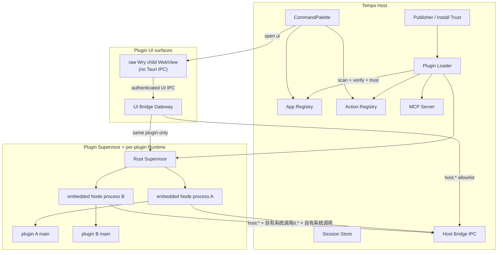
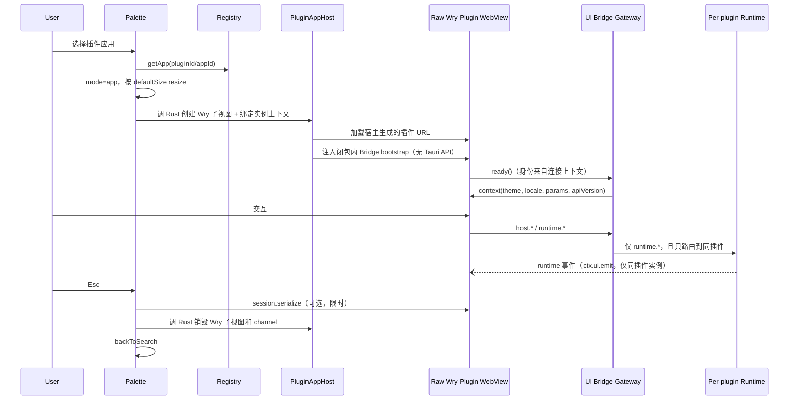

# Tempo 插件系统详细设计

> 版本：v0.4（增补修订稿）  
> 状态：MVP 实现基线  
> 产品定位：**Tempo 的核心是插件平台**；内置应用是第一批官方插件样板，不定义能力上限。  
> 范围：在现有「快捷面板 + 内置应用注册表 + 快捷操作注册表」之上，建设可分发的插件运行时与（后续）插件市场。  
> 目录：0 产品原则 · 1 背景与目标 · 2 概念模型 · 3 总体架构 · 4 Manifest · 5 有界面插件 · 6 无界面插件 · 7 Host Bridge · 8 信任与安装 · 9 面板集成 · 10 开发者体验 · 11 MCP · 12 威胁模型 · 13 分期 · 14 扩展点 · 15 验收 · 16 开放问题 · 附录 A–D

---

## 0. 产品原则（先读）

### 0.1 一句话

**Tempo 插件 = 经用户确认后运行的本机程序 + 必须通过宿主 API 才能嵌入快捷面板；main 的系统能力默认完整开放。**

### 0.2 学什么、不学什么

| 参考 | 采用 | 不采用 |
|------|------|--------|
| **VS Code** | Extension Host 完整运行时；`contributes` 清单；懒激活；发布者信任 | 细粒度 capability 沙箱；为每个系统调用做官方包装 |
| 浏览器扩展 | — | 默认最小权限、逐项授权模型 |

### 0.3 官方 API 的边界

官方 Host API **只解决「接进 Tempo」**，不替代操作系统：

- **要做**：注册命令 / 应用、面板生命周期、主题、（可选）Tempo 自有数据便捷接口  
- **不做**：把读盘、HTTP、进程、注册表等封装成完整 OS API 面  

系统级能力由每插件 embedded Node Runtime 直接提供。插件作者用标准库与系统调用实现业务；宿主不保证、也不追求「每个系统操作都有官方方法」。

### 0.4 安全模型定性

这是 **信任模型**，不是 **运行时权限沙箱**：

- 安装 / 启用插件 ≈ 信任该包在本机执行代码；验签后才可提升为发布者信任  
- 运行时与 Tempo 本体同级系统能力（读盘、联网、起进程等）  
- 防护靠：发布者信任、签名、审核、举报下架、用户侧载确认  
- **不要指望**用 Permission Guard 拦住恶意插件；官方文档应如实告知风险  

同时必须区分三种边界：

1. **系统权限不是沙箱边界**：main 一旦启动，就按当前用户权限运行。  
2. **进程隔离是生命周期与稳定性边界**：用于可靠停用、崩溃隔离和清理子进程，不承诺阻止恶意插件读写其它本机文件。  
3. **UI Bridge 是宿主数据边界**：插件 UI 不直接获得 Tauri IPC；Tempo 数据、其它插件通道和面板控制仍必须由宿主鉴权与路由。

未签名包中的 `publisher` 只是展示字段，**不能**作为可复用的安全身份。只有验签成功的发布者公钥才能建立“信任该发布者”；本地目录 / zip 在 Phase 1 仅按包内容或开发目录单独确认。

对照 VS Code：[Extension runtime security](https://code.visualstudio.com/docs/configure/extensions/extension-runtime-security) 写明 Extension Host 与 VS Code 同权；Workspace Trust 也明确拦不住恶意扩展自身执行代码。

---

## 1. 背景与目标

### 1.1 现状

Tempo 已完成主壳废弃，能力入口统一为快捷面板：

| 能力 | 现状 | 路径 |
|------|------|------|
| 内置应用 | 静态注册，面板内替换渲染 | `src/apps/registry.tsx` |
| 快捷操作 | 静态注册，按最近使用排序 | `src/apps/actions/*` |
| 会话持久化 | 可选 `persistSession` | `src/apps/session.ts` |
| 本机应用启动 | OS 索引 + usage | `commands/launcher.rs` |
| AI 能力暴露 | MCP HTTP Server | `src-tauri/src/mcp/` |

内置与插件共用概念模型（`source: "builtin" \| "plugin"`），动态加载与市场尚未实现。

### 1.2 目标

1. **插件是一等公民**：长期形态以插件市场为核心；内置应用逐步可视为官方插件。  
2. **有界面插件（UI Plugin）**：在快捷面板中作为「应用」出现，体验对齐内置应用。  
3. **无界面插件（Headless Plugin）**：注册快捷操作、后台任务、事件钩子、MCP Tool 等。  
4. **完整系统权限运行时**：插件可实现远超内置清单的能力（改 hosts、扫端口、调 CLI、任意 HTTP…）。  
5. **统一清单与宿主贡献 API**：两类插件共用 manifest、安装目录、Loader、Host Bridge（**集成面**，非权限闸门全集）。  
6. **可演进到市场**：本地目录 / zip → 签名侧载 → 官方市场与更新通道。

### 1.3 非目标（本期不做）

- 细粒度运行时权限沙箱（`clipboard.read` 式默认拒绝）  
- 为任意系统操作提供官方 API 全集  
- 完整付费 / 结算体系（市场可后期）  
- 任意未签名原生 `.dll` 注入 Tempo 主进程（原生扩展若需要，走独立进程）  
- 跨机器插件同步  

---

## 2. 概念模型

```text
Plugin Package
├── manifest.json          # 元数据、贡献点、运行时入口、引擎版本
├── dist/
│   ├── ui/                # 有界面：面板内嵌页面（可选）
│   └── main/              # 每插件 Runtime 入口：完整权限 JS（可选）
├── icons/
└── README.md
```

### 2.1 插件类型

| 类型 | 标识 | 用户可见形态 | 典型例子 |
|------|------|--------------|----------|
| 有界面 | `kind: "ui"` 或贡献 `apps[]` | 与内置应用同级 | 看板、第三方工具页 |
| 无界面 | `kind: "headless"` | 快捷操作 / 后台 / MCP | 自动化、Webhook、增强剪贴板 |
| 混合 | `kind: "hybrid"` | 两者皆有 | 有设置页 + 常驻同步 |

> 以**贡献点（contributes）**为准，`kind` 仅分类提示。一个包可同时贡献 UI 与 Headless。

MVP 支持没有 `main` 的纯 UI 包：它只运行在隔离 raw Wry WebView 中并使用允许的 `host.*`，不启动 Node Runtime。启用确认应据实展示其较小的执行面，但它仍可能读取用户明确开放给该 UI 的 Tempo 数据，不能跳过信任确认。纯 UI 包调用 `runtime.*` 一律返回 `RUNTIME_UNAVAILABLE`；其持久化主要依赖 `storage.plugin.*`（UI 侧没有 Node fs）。

### 2.2 与现有对象映射

```text
manifest.contributes.apps[]      →  TempoApp（扩展现 BuiltinApp）
manifest.contributes.actions[]   →  QuickAction
manifest.contributes.mcpTools[]  →  MCP tool router（可选）
manifest.contributes.hooks[]     →  宿主事件订阅
manifest.contributes.commands[]  →  每插件 Runtime 内可调用的命令
```

前端 `BuiltinApp` 逐步泛化为：

```ts
type AppSource = "builtin" | "plugin";

interface TempoApp {
  id: string;                 // pluginId/appId，全局唯一
  name: string;
  keywords: string[];
  icon: AppIconDescriptor;
  source: AppSource;
  pluginId?: string;
  defaultSize?: { width?: number; height?: number };
  persistSession?: boolean;
  sessionVersion?: number;
  ui:
    | { type: "react"; component: ComponentType<TempoAppProps> }  // 内置
    | { type: "plugin-webview"; entryPath: string };              // raw Wry 子视图；URL 由宿主生成
}

type AppIconDescriptor =
  | { type: "lucide"; icon: LucideIcon }   // 内置沿用现状
  | { type: "file"; path: string };        // 插件包内 PNG / SVG
```

插件图标只接受包内 PNG / SVG 文件，宿主始终以 `` 方式渲染，**不将 SVG 内联进宿主 DOM**（SVG 可携带脚本 / `foreignObject`，内联等于向宿主 realm 注入）。`QuickAction.icon` 做同样的泛化。

### 2.3 两层能力（关键）

```text
┌─────────────────────────────────────────────┐
│  A. 系统能力（完整开放）                       │
│     fs / net / child_process / OS API…        │
│     → 由每插件 Plugin Runtime 直接提供          │
├─────────────────────────────────────────────┤
│  B. 宿主集成（官方 API，小而稳）                │
│     注册 apps/actions、面板、主题、Tempo 数据…  │
│     → 经 Host Bridge / SDK 调用               │
└─────────────────────────────────────────────┘
```

没有 B，插件无法嵌入 Tempo。  
没有 A，插件只能做「官方已实现功能的皮肤」，无法支撑以市场为核心的产品。

---

## 3. 总体架构



### 3.1 分层

| 层 | 职责 |
|----|------|
| **Package** | 插件包与 manifest |
| **Trust** | 包哈希 / 开发目录确认；签名阶段验证发布者公钥；启用确认 |
| **Loader** | 安全解包、清单与路径校验、引擎版本校验、声明式贡献注册 |
| **Plugin Supervisor** | 为每个插件启动、监控、停止独立运行时；清理进程树；崩溃退避 |
| **Plugin Runtime** | **与 Tempo 同权的内置 Node 运行时**；加载一个插件 main；跑 commands / hooks |
| **Registry** | App / Action / Hook / MCP 挂载 |
| **Host Bridge** | 宿主集成 API（面板、注册表、Tempo 数据…） |
| **UI Surface** | 面板内 raw Wry 子 WebView；不注册为 Tauri Webview；经专用 IPC handler 通信 |
| **Shell** | 快捷面板、设置「插件 / 市场」、托盘 |

### 3.2 进程模型（MVP 决策）

| 进程 / 上下文 | 权限 | 说明 |
|---------------|------|------|
| Tempo 主进程（Rust） + 宿主 WebView | 完整 | 宿主核心、SQLite、窗口；仅宿主 WebView 绑定默认 Tauri capability |
| **Plugin Supervisor（Rust）** | 完整 | 管理子进程、IPC、心跳、退出与崩溃退避 |
| **每插件 Node Runtime** | **完整（与用户同权）** | 一个进程只加载一个插件 main；不得复用为多插件共享进程 |
| 插件 UI raw Wry 子 WebView | 网页权限 | 不注册进 Tauri Webview 集合，无 Tauri 初始化脚本 / IPC；只能访问本插件资源和专用 Bridge |

要点：

1. **完整权限在每插件 Node Runtime，不在插件 raw Wry WebView。** UI 只是视图；系统操作在 main。  
2. 一个插件崩溃、死循环或停用，只允许影响自己的进程与 UI；不得要求重启 Tempo 或其它插件。  
3. `deactivate` 只用于优雅退出，不能作为可靠卸载手段。超时后由 Supervisor 杀死整个进程树：Windows 使用 Job Object，Unix 使用 process group。  
4. 进程隔离服务于稳定性和可回收性，**不是**针对恶意代码的权限沙箱。

### 3.3 语言选型

| 选择 | 结论 |
|------|------|
| 一等公民 | **TypeScript / JavaScript** |
| main 运行时 | **按需下载**的插件专用 **Node 24 LTS**（Tempo 锁定 patch）；不随 Tempo 安装包分发，不使用系统 Node |
| main 格式 | 单一 bundled ESM；入口不得引用包外文件 |
| 依赖 | npm 依赖与 `@tempo/plugin-sdk` 均打入 bundle；Node built-ins 保持 external |
| UI | Web（HTML/CSS/JS），raw Wry child WebView 面板内嵌（纯 UI 包**不需要** Node Runtime） |
| 重逻辑 / 系统集成 | Runtime 内 Node API；或插件自行 `spawn` 随包分发的其它语言二进制 |
| MVP 不支持 | Node native addon、主进程动态库、系统 Node、默认 Python 运行时 |

#### 3.3.1 插件运行时（Plugin Runtime）按需安装

Tempo 安装包**不附带** Node，以保持本体体积小。需要执行 `main` 的第三方插件，依赖本机已安装的「插件运行时」：

```text
用户首次启用 / 激活含 main 的插件
  → 检测 Plugin Runtime 是否已安装且版本匹配
  → 未安装：设置页 / 确认对话框提示「需要安装插件运行时」
  → 用户确认后，从 Tempo 官方渠道下载对应 target 的 Node 发行包
  → 校验 SHA-256（及可选签名）→ 解压到 Tempo 管理目录
  → 之后所有含 main 的插件共用这一份插件专用 Node
```

| 规则 | 说明 |
|------|------|
| 与系统 Node 无关 | 不读 `PATH`、不用 `node` 命令、不升级用户全局 Node |
| 安装位置 | `{app_data}/plugin-runtime/node/{lockedVersion}/`（可执行文件路径写入设置 / SQLite） |
| 版本策略 | 每个 Tempo 产品版本锁定一个 Node patch；清单由官方 manifest（URL + hash）下发 |
| 谁需要装 | 仅当启用的插件声明了 `main`，或首次将触发 Runtime 激活；**纯 UI 包跳过** |
| 下载渠道 | 仅 Tempo 配置的官方 endpoint（可镜像官方 Node 构建）；禁止插件自行指定 Node 下载地址 |
| 校验 | 下载完成后必须 SHA-256 匹配才启用；失败保留未安装状态并提示重试 |
| 更新 | Node 安全补丁随 Tempo 补丁提示「更新插件运行时」；旧版本目录可保留一版以便回滚 |
| 离线 | 未安装 Runtime 时，含 `main` 的插件可导入 / 信任，但激活失败并引导安装；已安装则可离线运行 |
| 卸载 | 设置页提供「卸载插件运行时」；卸载后所有含 main 的插件回到不可激活状态 |

Runtime 固定 `cwd` 为插件只读安装目录，另通过 `ExtensionContext.paths.data` 提供可写数据目录。Supervisor 只用 Tempo 管理目录下的 Node 可执行文件启动子进程；注入最小启动环境并记录实际 Node 版本。stdout/stderr 由宿主按 `plugin_id` 收集，默认做大小轮转。

---

## 4. Manifest 规范

文件：`manifest.json`

```jsonc
{
  "manifestVersion": 1,
  "id": "com.example.polyglot",
  "name": "示例聚合扩展",
  "version": "1.0.0",
  "engines": {
    "tempo": ">=1.2.0",
    "pluginApi": "^1.0.0"
  },
  "kind": "hybrid",
  "author": "Example",
  "publisher": "example",              // 未验签时仅展示，不作为安全身份
  "description": "……",
  "homepage": "https://example.com",   // 以下四项为可选元数据，市场展示用
  "repository": "https://github.com/example/polyglot",
  "license": "MIT",
  "categories": ["tools"],
  "main": "dist/main/index.mjs",       // 单一 bundled ESM（有系统权限）
  "executables": [],                    // 可选；随包独立进程入口的相对路径
  "capabilities": ["filesystem", "network", "process"],
  "activationEvents": [],              // command/hook 等默认由 contributes 推导
  "contributes": {
    "apps": [
      {
        "id": "main",
        "name": "示例面板",
        "keywords": ["demo", "示例"],
        "icon": "icons/app.png",
        "entry": "dist/ui/index.html",
        "defaultSize": { "width": 920, "height": 680 },
        "persistSession": true,
        "sessionVersion": 1
      }
    ],
    "actions": [
      {
        "id": "quick-run",
        "name": "示例处理",
        "keywords": ["demo"],
        "icon": "icons/action.png",
        "requiresQuery": true,
        "titleTemplate": "示例处理：{query}",
        "command": "quick-run"
      }
    ],
    "commands": [
      {
        "id": "quick-run",
        "title": "示例处理",
        "visibility": "private"
        // handler 在 activate 内 registerCommand
      },
      {
        "id": "on-clipboard",
        "title": "处理剪贴板事件",
        "visibility": "private"
      },
      {
        "id": "mcp-echo",
        "title": "MCP Echo",
        "visibility": "private"
      }
    ],
    "hooks": [
      { "event": "clipboard.changed", "command": "on-clipboard" }
    ],
    "mcpTools": [
      {
        "name": "echo",
        "description": "Echo text",
        "command": "mcp-echo",
        "inputSchema": {
          "type": "object",
          "properties": { "text": { "type": "string" } }
        }
      }
    ]
  }
}
```

### 4.1 ID 规则

- 插件包 ID：最长 128 字符的小写反向域名，匹配 `^[a-z0-9]+(\.[a-z0-9-]+)+$`。  
- manifest 内局部 ID：匹配 `^[a-z][a-z0-9-]{0,63}$`，不得包含 `/`、`..` 或编码后的路径分隔符。  
- 插件只能提交局部 ID；Loader 生成不可伪造的运行时 ID：`{pluginId}/{localId}`。  
- `builtin`、`tempo` 及其派生命名空间保留，插件 ID 不得使用。  
- App / Action / Command / Hook / MCP 统一采用上述规则；任何重复都使该插件整包注册失败，**禁止后注册者静默替换**。  
- usage ID：`builtin:{appId}`、`plugin:{pluginId}/{appId}`、`action:{pluginId}/{actionId}`。

Command 默认 `visibility: "private"`，只能被本插件 action、UI 和 MCP 映射调用。跨插件调用必须由提供方声明 `public`，调用方使用完整运行时 ID；handler 的 `CommandContext` 会得到 `callerPluginId` / `callerType`，宿主记录调用双方。

MCP 对外名称由宿主生成，不直接接受插件提供全局名称：默认是 `tempo_{pluginId 转下划线}_{localName 转下划线}`；若超过 128 字符，则截断插件段并加入 package ID SHA-256 的前 12 个 hex。生成结果冲突时拒绝后注册者。

### 4.2 关于 `permissions` 字段

**v0.2 起：不再作为默认安全边界。**

| 做法 | 说明 |
|------|------|
| 可保留 `capabilities` / `permissions` **声明** | 仅用于市场展示、「此插件可能访问文件系统/网络」等知情同意文案 |
| **不**在运行时按声明拦截 `fs` / `net` / `spawn` | 与「完整权限」产品原则冲突 |
| Tempo **自有数据**写操作 | 仍可通过 Host API 做可选确认（产品策略），但这是业务策略而非 OS 沙箱 |

`capabilities` 使用固定枚举：`filesystem | network | process | clipboard | system`。未知值警告并忽略——它只影响展示文案，不影响运行行为。

首次启用确认文案应明确：

> 启用此插件将允许其在本机执行代码，权限与 Tempo 相近，请仅安装信任的来源。

若 manifest 没有 `main`，改为说明“将在隔离视图中运行网页代码，并可调用下列 Tempo 接口”，不得误称其拥有完整 Node 权限。

### 4.3 版本与路径校验

- `manifestVersion` 决定清单结构；Loader 只接受明确支持的整数版本。  
- `engines.pluginApi` 决定 Host Bridge / SDK 兼容性；`engines.tempo` 只表达产品版本依赖，不能替代 API 版本。  
- MVP 的 command 和 UI runtime 调用从贡献点推导激活；Phase 2 的 hook 也自动推导。`activationEvents` 在 MVP 只额外接受 `onStartup`，没有 `main` 的包不得声明。  
- Node 版本由 Tempo 固定并通过 `ExtensionContext.runtime.nodeVersion` 暴露，不由插件选择。  
- `main`、`entry`、`icon`、`executables[]` 只能是插件根目录内的规范化相对路径，不接受 URL、绝对路径、盘符、UNC 或符号链接跳转；Unix 只为 `executables[]` 中的普通文件设置执行位。  
- Loader 使用 JSON Schema 校验类型、长度和贡献点引用；action、hook、MCP 引用的 command 必须存在于同一 manifest。
- `persistSession=true` 时必须提供正整数 `sessionVersion`；版本不匹配的旧 payload 不传给插件。
- 已识别但当前 Tempo 版本尚未实现的贡献点必须导致明确的兼容性错误，不能静默忽略；插件应通过 `engines.tempo` 选择最低宿主版本。  
- 前向兼容规则：顶层未知**元数据**字段（如未来新增的市场展示字段）warn + ignore，保证旧宿主可安装新插件；`contributes` 内未知键仍按上一条报兼容性错误——元数据不影响行为，贡献点缺失意味着功能不可用，二者不能同策略。  
- `engines` 兼容性在安装时校验，并在每次 Tempo / pluginApi 升级后对全部已安装插件**复评**；不再兼容的插件自动置为 disabled，在设置页标注原因与建议动作，不得带病启动。

---

## 5. 有界面插件设计

### 5.1 打开流程



### 5.2 渲染

```text
[ ← 返回 ]  应用名
┌─────────────────────────────┐
│  PluginAppHost              │
│   └─ raw Wry child WebView  │
└─────────────────────────────┘
```

- `entryPath` 经规范化校验后，由 Rust 映射到仅注册在该视图上的 `tempo-plugin-{pluginIdSha256前32位}://localhost/` 自定义协议；不接受插件自报 URL，不使用裸 `file://` 或 Tauri 全局 asset protocol。创建视图时校验 hash 到完整 plugin ID 的反向映射，理论碰撞也必须拒绝。  
- 插件协议必须注册为 **secure context**（各平台按惯例映射，如 Windows WebView2 上以 `https://{scheme}.localhost/` 形式呈现），否则 `navigator.clipboard`、`crypto.subtle` 等仅安全上下文可用的 Web API 在插件页全部失效；若某平台无法保证，宿主以 `host.clipboard.*` 等便捷方法补齐并在 SDK 文档标注差异。  
- 插件视图由 Rust 通过 Wry 直接创建为宿主窗口的 child WebView，不注册为 Tauri `Webview`，不与宿主 SPA 共享 DOM、JavaScript realm、cookie 或本地存储命名空间。  
- 插件视图不加载 Tauri initialization scripts，也不进入 Tauri invoke router；`withGlobalTauri` 同时关闭作为纵深防护。默认 capability 改为明确匹配宿主 WebView label，不为插件创建 label。  
- React `PluginAppHost` 只能通过宿主命令请求 Rust 创建、调整物理像素 bounds 和销毁视图；Rust 在窗口 resize / DPI change 时重新计算 bounds。  
- 宿主响应插件资源时再次按 channel 绑定的插件根目录做路径校验，插件 A 不能请求插件 B 或 Tempo 数据目录资源。  
- 宿主设置最低 CSP：脚本只允许本插件 origin，禁止 `object`、子 frame、任意导航和远程脚本；网络请求可按 Web CSP 放行，但不把 CSP 宣称为 main 的权限沙箱。  
- 外部导航统一拦截并交给宿主确认 / 打开；页面自行跳转不得离开插件 origin。

最低 CSP 基线（插件只能进一步收紧，不能放宽 `script-src`、`object-src`、`frame-src`、`base-uri`）：

```text
default-src 'self'; script-src 'self'; style-src 'self' 'unsafe-inline';
img-src 'self' data: blob: https:; media-src 'self' blob:;
connect-src https: http: ws: wss:;
object-src 'none'; frame-src 'none'; base-uri 'none'; form-action 'none'
```

> `img-src` / `media-src` 放行 `blob:` 是必须的：基线只允许收紧，若基线禁掉 blob，画布导出、图像处理、音视频类插件将永远无法实现。

### 5.3 UI ↔ 宿主 / Runtime

三种通道：

1. **`host.*`（Bridge）**：面板控制、主题、打开其它 App、Tempo 数据便捷 API。  
2. **`runtime.*`（Runtime RPC）**：只调用同一插件 main 注册的 command；首次调用可触发懒激活。  
3. **Runtime 事件（main → UI）**：UI 通过 `runtime.on(event)` 订阅本插件 main 用 `ctx.ui.emit(event, payload)` 广播的事件，覆盖进度上报、后台任务完成等场景。事件只路由到同插件**存活的** UI 实例；实例关闭即丢弃，宿主不持久化、不重放；每实例事件队列上限默认 256 条，溢出丢最旧并在诊断日志计数。

SDK 统一封装三者。Bridge bootstrap 包装 Wry 专用 IPC handler，页面只获得类型化方法。每个 handler closure 在 Rust 创建视图时已绑定 `view_instance_id`、origin 和 `plugin_id`，Gateway 不接受页面在 payload 中自报身份；安全性也不依赖在 JavaScript 中隐藏 token。每条消息同时校验实例存活状态、当前 origin 和 method allowlist。内置 React 应用不经过此通道。

### 5.4 与内置对齐

| 行为 | 插件 |
|------|------|
| Esc → 搜索 | 是（bootstrap 键盘转发，见下方契约） |
| 失焦 + `persistSession` | 重新打开并恢复序列化 payload，不保活 WebView |
| 最近使用 | 是（`plugin:` usage） |
| 打开传参 | 是（通用 `params`） |
| 主题 | 是 |

**焦点与按键契约**：child WebView 持有键盘焦点时，宿主 SPA 收不到任何 DOM 键盘事件——「Esc → 搜索」不能假设宿主自然收到按键。Bridge bootstrap 在页面脚本运行前于 window 捕获阶段注册键盘监听，将 Esc（后续可扩展导航键）转发给宿主执行返回；页面自身的 `preventDefault` / 后注册的监听不影响该转发。若注入失败或页面无响应，顶部返回按钮与失焦关闭逻辑作为兜底退出路径——这属于可用性保障，不是安全边界。

### 5.5 会话恢复契约

`persistSession` 表示“关闭后重新创建 WebView，并恢复插件返回的 JSON payload”，**不**表示隐藏或保活旧 WebView。关闭前宿主调用 `session.serialize`，等待最多 300 ms；超时、异常或数据超过 64 KiB 时仍立即关闭，仅放弃本次状态。

插件会话由宿主存储为 `{ pluginId, appId, pluginVersion, sessionVersion, payload, updatedAt }`。恢复时通过初始化 context 传回；插件禁用 / 卸载时清除。插件版本变化且 `sessionVersion` 不兼容时也清除。payload 不应用于保存密码、token 等秘密；长期敏感数据应写入插件数据目录或未来的凭据 API。

---

## 6. 无界面插件设计

### 6.1 能力形态

1. **快捷操作** → 调本插件 Runtime command（可任意系统副作用）  
2. **Commands** → 可被 action / UI / MCP 调用；其它插件仅可调用显式 public command  
3. **Hooks** → 订阅 clipboard、todo、pomodoro 等；事件名统一为 `域.动作过去式`（如 `clipboard.changed`），payload 携带 `schemaVersion`，事件目录随 Phase 2 定义  
4. **MCP Tools** → 动态挂到现有 MCP Server  
5. **Schedules**（二期）→ interval / cron  

声明式 action 无法携带内置 action 的 `validate` / `title` 函数字段（函数进不了 manifest）：动态标题使用 `titleTemplate`（仅支持 `{query}` 占位符，宿主转义后渲染）；输入校验在 command 执行时完成，返回 `COMMAND_FAILED` 的 message 由面板展示给用户。

### 6.2 生命周期

```text
install:   extract to staging → verify → atomic publish as untrusted → disabled
enable:    trust/confirm → register declarative contributes → enabled (runtime 尚未启动)
activate:  activation event → spawn runtime → activate(ctx) → active
disable:   mark draining → reject new calls → close UI → cancel pending RPC
           → deactivate(timeout) → kill process tree → unregister contributes → disabled
uninstall: disable → remove current package pointer → move version to _trash
           → optional delete plugin data
```

状态至少包括 `disabled | enabled | starting | active | draining | failed`。状态变更由 Rust Supervisor 串行化；启用、停用、更新同一插件不得并发执行。Runtime 崩溃后，当前调用返回结构化错误；Supervisor 在 10 分钟滑动窗口内最多自动重启 3 次，退避为 1 / 5 / 30 秒，随后进入 `failed`，由用户手动重试。声明式入口可以保留并显示“插件启动失败”，但禁用后必须立即从 Registry 消失。Tempo 重启时持久化的 `active/starting/draining` 一律归一为 `enabled`，不得假定旧子进程仍存在。

### 6.3 Runtime 执行模型

```ts
// 伪代码：插件 main；SDK 仅提供类型/构建辅助并被打入 bundle
import type { ExtensionContext } from "@tempo/plugin-sdk";
import fs from "node:fs";

export async function activate(ctx: ExtensionContext) {
  ctx.registerCommand("quick-run", async (input, signal) => {
    // 完整系统权限：直接使用 Node
    const text = await fs.promises.readFile(input.path, "utf8");
    // 接回 Tempo
    await ctx.host.notify.show({ title: "Done", body: text.slice(0, 80) });
  });
  ctx.registerCommand("on-clipboard", async (event) => { /* ... */ });
  ctx.registerCommand("mcp-echo", async ({ text }) => ({ text }));
}

export async function deactivate() { /* optional graceful cleanup */ }
```

Loader 不执行插件代码即可注册 manifest 中的声明式贡献。激活事件由贡献点自动推导：首次执行 command、UI 首次调用 `runtime.*`，以及 Phase 2 起首个 hook 事件到达；显式 `onStartup` 只允许确有常驻需求的插件声明。`activate` 必须在 10 秒内完成，并注册 manifest 声明的 handler；失败时终止该 Runtime，不留下部分动态注册。每个 command 默认 30 秒超时并接收 `AbortSignal`；超时后给 5 秒清理宽限，仍未结束则由 Supervisor 终止该 Runtime。同步死循环不能靠 JavaScript cancellation 中断，最终同样通过杀进程处理。

---

## 7. Host Bridge API（MVP 协议）

Bridge **不是**「唯一能碰系统的通道」，而是 **嵌入 Tempo 的插座**。

Runtime 使用专用本地 IPC：Windows 为带当前用户 ACL 的随机 named pipe，macOS / Linux 为权限 `0600` 的随机 Unix domain socket。Supervisor 创建端点后，将一次性 256-bit 握手凭据经 **stdin** 传给预期 PID 的 bootstrap——不使用 argv（进程列表可见）或环境变量（默认泄漏给子进程）；握手成功即销毁凭据。协议采用 `u32 big-endian length + UTF-8 JSON` 帧，stdout/stderr 仅用于日志，不能承载协议。UI 使用 raw Wry WebView 的专用 IPC handler，不经过 Tauri invoke。两种传输进入宿主后统一为以下信封：

```ts
type RpcRequest = {
  v: 1;
  type: "request";
  id: string;
  method: string;
  params: unknown;
};

type RpcResponse =
  | { v: 1; type: "response"; id: string; ok: true; result: unknown }
  | { v: 1; type: "response"; id: string; ok: false; error: RpcError };

type RpcCancel = { v: 1; type: "cancel"; id: string };
type RpcEvent = {
  v: 1;
  type: "event";
  subscriptionId: string;
  event: string;
  payload: unknown;
};

type RpcError = {
  code: "INVALID_REQUEST" | "PAYLOAD_TOO_LARGE" | "RESOURCE_EXHAUSTED" |
        "NOT_FOUND" | "FORBIDDEN" | "TIMEOUT" | "CANCELLED" |
        "ACTIVATION_FAILED" | "RUNTIME_UNAVAILABLE" |
        "COMMAND_FAILED" | "INTERNAL";
  message: string;
  data?: unknown;
};
```

`plugin_id`、来源类型（UI / Runtime）、Wry view instance 和 runtime PID 只存在于宿主的 `ConnectionContext`，不出现在可信 payload 中。Runtime 端点同时校验握手凭据和 Supervisor 记录的子进程；它用于防止其它普通插件误连，不宣称抵御已获同用户权限的恶意进程。默认限制：单消息 1 MiB、每插件 32 个并发请求、Host API 30 秒超时；面板尺寸等交互方法使用更短超时。超限请求返回错误而不是无限排队。连接关闭、插件停用或调用方取消时，宿主必须结束 pending request 并释放订阅。返回给插件的 `INTERNAL` 不包含 Rust / Node stack、绝对路径或其它插件信息，详细错误只进入本地诊断日志。

`COMMAND_FAILED` 与 `INTERNAL` 必须严格区分：前者承载插件 command 自身抛出 / 返回的**业务错误**，message / data 由该插件生成，宿主原样转发给调用方（自己的 UI、action、MCP 映射，以及跨插件 public 调用方），不附加宿主内部细节；后者仅表示宿主或 Runtime 基础设施故障，按上述脱敏规则处理。若不区分，插件 UI 将永远无法向用户展示自己 main 抛出的错误信息。

### 7.1 方法清单（MVP 最小集）— 只含宿主集成

| Method | 调用方 | 说明 |
|--------|--------|------|
| `palette.hide` | UI / main | 收起面板（main 常用于 action 执行完成后） |
| `palette.back` / `palette.setSize` | UI | 绑定当前视图实例；`setSize` 由宿主按面板最小 / 最大尺寸与屏幕工作区 clamp |
| `app.open` | UI / main | 打开已注册 TempoApp |
| `external.open` | UI / main | 经宿主 URL 校验 / 用户策略后用默认应用打开外链 |
| `notify.show` | UI / main | 系统通知（亦可插件自调 OS，提供便捷） |
| `theme.get` + `theme.onChange` | UI / main | 主题；`onChange` 返回 subscription ID |
| `subscription.release` | UI / main | 显式释放订阅；连接关闭时宿主自动清理该连接全部订阅 |
| `session.serialize` / restore context | 宿主 → UI | PluginAppHost 生命周期专用，不作为跨插件通用方法 |
| `storage.plugin.*` | UI / main | 插件私有 KV（默认总量 5 MiB、单值 256 KiB，可调）；纯 UI 包的主要持久化途径；main 亦可直接读写数据目录 |
| `todos.*` / `snippets.*` / … | UI / main | **可选** Tempo 业务便捷 API（插件也可用自己的存储） |
| `mcp.registerTool` 等 | Loader | 不对通用 invoke 开放；仅由 Loader 根据已校验 manifest 挂载 |

**明确不提供（也不需要）：** 完整 `fs.*` / `http.fetch` 代理 / `shell.exec` 官方封装——这些在每插件 Runtime 中用 Node 即可。

### 7.2 稳定性

- Host API 独立使用 `pluginApi` semver；插件通过 `engines.pluginApi` 声明兼容范围。  
- Tempo 产品版本只用于整体兼容检查；不得用产品版本推断某个 Bridge 方法存在。  
- embedded Node 版本由用户按需安装的插件运行时决定，Tempo 锁定兼容的 patch 范围，并在插件诊断信息中显示实际路径与版本。  
- 业务便捷 API 可按产品需要增减；系统能力不依赖它们。

---

## 8. 信任、安装、市场

### 8.1 目录布局

```text
{app_data}/
  plugin-runtime/
    node/
      24.x.y/                # 按需下载的插件专用 Node（与系统无关）
        bin/node 或 node.exe
    manifest.json            # 本地记录：版本、hash、安装时间
  plugins/
    packages/
      com.example.polyglot/
        1.0.0/               # 安装后只读；current version 由 SQLite 指向
          manifest.json
          dist/...
    data/
      com.example.polyglot/  # 插件可写数据，与包版本分离
    _staging/
    _trash/
```

SQLite（核心字段示意）：

```sql
CREATE TABLE plugins (
  id TEXT PRIMARY KEY,
  current_version TEXT NOT NULL,
  pending_version TEXT,
  enabled INTEGER NOT NULL,
  runtime_state TEXT NOT NULL,
  installed_at TEXT NOT NULL,
  updated_at TEXT,
  last_error TEXT
);

CREATE TABLE plugin_versions (
  plugin_id TEXT NOT NULL,
  version TEXT NOT NULL,
  package_hash TEXT,                  -- dev_directory 可为空
  dev_path TEXT,
  display_publisher TEXT,
  verified_publisher_key TEXT,
  install_source TEXT NOT NULL,   -- local | marketplace | dev_directory
  signature_status TEXT NOT NULL, -- unsigned | valid | invalid | revoked
  trusted_at TEXT,
  installed_at TEXT NOT NULL,
  PRIMARY KEY (plugin_id, version),
  UNIQUE (plugin_id, package_hash),
  CHECK (
    (install_source = 'dev_directory' AND dev_path IS NOT NULL) OR
    (install_source <> 'dev_directory' AND package_hash IS NOT NULL)
  )
);

CREATE TABLE publisher_trust (
  signing_key_id TEXT PRIMARY KEY,
  publisher_id TEXT NOT NULL,
  trusted_at TEXT NOT NULL,
  revoked_at TEXT
);
```

全包 `package_hash` 使用版本化算法：对按 UTF-8 字节序排序的规范化相对路径，依次 hash 路径长度、路径、文件长度和文件内容（SHA-256）；Phase 2 的签名信封本身不参与内容 hash。它不能只覆盖 manifest。插件包目录与数据目录必须分离，更新和回滚不得覆盖用户数据。

### 8.2 安装来源

| 阶段 | 来源 |
|------|------|
| Phase 1 | 本地文件夹（复制安装）/ zip；开发模式目录引用 |
| Phase 2 | 签名包侧载 |
| Phase 3 | **官方插件市场**（浏览、安装、更新、举报） |

### 8.3 信任流程

1. Loader 只解析 JSON、校验文件和计算 hash；**用户确认前不得 import main、执行构建脚本或加载插件 UI**。  
2. Phase 1 的普通目录 / zip 按 `package_hash` 确认。相同 hash 可复用本机决定；代码、资源或版本发生任何变化都必须重新确认。`publisher` 只用于展示。  
3. 开发目录内容可随时变化，不参与包 hash 信任。它只能在显式开发者模式加载，始终显示“开发中 / 未验证”标识，并在每次 Tempo 进程首次加载时确认；不得继承发布者信任。  
4. Phase 2 起，签名覆盖完整包 hash，并将发布者身份绑定到公钥指纹。只有 `signature_status=valid` 时，才允许询问“信任此发布者”，并复用 `publisher_trust`。  
5. 更新时若 hash 改变且没有受信任签名，保持旧版本运行，直到用户确认新包。签名无效、密钥撤销或包内容不匹配时直接拒绝启用。  
6. 企业场景（后期）：允许列表、仅市场包、禁止侧载和签名密钥策略。

用户拒绝只改变信任记录，不删除导入文件；插件保持 disabled，且任何贡献点均不可见。撤销包 / 发布者信任会先执行完整停用流程。

### 8.4 安全安装与更新事务

1. 在同卷创建 `_staging/{operation_id}`。zip 先复制归档并枚举 central directory；普通目录使用不跟随链接的目录遍历。校验条目前不得写出包内容。  
2. 默认限制为：输入 100 MiB、落盘后 500 MiB、10,000 个文件、单文件 200 MiB；解压 / 复制过程中持续累计，超限立即终止并清理 staging。  
3. 写出前拒绝绝对路径、`..`、空段、盘符、UNC、NTFS alternate data stream、平台保留名称，以及符号链接、硬链接、junction 等重定向条目。路径统一为 `/` 分隔并做 Unicode NFC；同时拒绝在目标平台会发生的大小写或 Unicode 归一化碰撞。  
4. 流式写出每个普通文件时再次规范化目标，确认仍位于 staging 根目录；再校验 manifest、贡献点引用、引擎范围和入口格式。校验阶段不得执行包内代码。  
5. 计算确定性的全包 hash 后，将 staging 原子 rename 为 `packages/{id}/{version}`，记录为未信任的 disabled 安装；该步骤仍不执行代码。同 `id + version` 但 hash 不同的包不得原地覆盖。  
6. 首次安装可直接设置 `current_version` 但保持 disabled。更新先记录 `pending_version`，用户确认新 hash / 签名后才进入 draining、停止旧 Runtime，并用 SQLite 事务切换 current。  
7. 若数据库提交失败，恢复旧指针。若原插件更新前处于 active / `onStartup`，新 Runtime 启动或健康检查失败时自动回滚；懒激活插件首次启动新版本失败时向用户提供一键回滚，不静默反复切换。  
8. 回滚后可重新启动旧版本。卸载同样先停进程树，再移动包目录，延迟清理以处理 Windows 文件占用。  
9. 安装目录尽力设为只读。完整性复核须兼顾启动性能——按上限（500 MiB × N 个插件）每次 boot 全量 SHA-256 不可行：在**执行任何插件代码之前**（启动 Runtime、加载 UI 资源）必须完成该插件的全包 hash 复核；boot 时对其余已启用插件只做文件数 / 大小 / mtime 快速指纹比对，完整 hash 由后台低优先级任务补齐，发现不一致立即禁用并提示重装。该机制用于发现损坏 / 篡改，不宣称能阻止同用户权限的恶意程序修改文件。

### 8.5 设置页

- **插件运行时**：未安装 / 已安装版本与路径、安装或更新、卸载；下载进度  
- 已安装列表、启用开关、来源、包 hash、发布者与签名状态  
- Runtime 状态 / 最近错误 / 重试、打开插件数据目录、查看贡献点  
- 「加载本地插件」（开发者）  
- 撤销包或发布者信任、删除插件数据  
- 开发目录保持醒目的未验证标识  
- 后期：市场入口、更新与密钥状态  

### 8.6 市场安全（运行时之外）

| 手段 | 作用 |
|------|------|
| 发布者账号与信任 | 用户知情同意 |
| 包哈希 / 签名 | 防篡改 |
| 审核 / 恶意扫描 | 降低上架风险 |
| 举报与下架 | 事后响应 |
| 自动更新渠道可信 | 防供应链替换 |

这些 **不能** 变成「无完整权限就安全」的错觉；文档与安装 UI 保持诚实。

---

## 9. 快捷面板集成点

- 「应用」同一网格；角标区分内置 / 插件。  
- 快捷操作合并 usage 排序。  
- Boot：`Loader.scan` → 快速指纹 + 信任复核（完整 hash 策略见 8.4-9）→ 对启用包注册声明式贡献；只有 `onStartup` 插件或首次触发才启动 Runtime。  
- Registry 变更必须发出订阅事件，React 视图不能只在模块加载时读取一次静态数组。  
- 一个插件的贡献注册是事务：全部 ID、引用与资源校验通过后一次提交；失败不留下半注册状态。  

```ts
interface PluginRegistry {
  registerApp(ownerPluginId: string, app: TempoApp): Registration;
  registerQuickAction(ownerPluginId: string, action: QuickAction): Registration;
  unregisterAll(ownerPluginId: string): void;
}
```

`Registration.dispose()` 和 `unregisterAll` 都必须验证 owner，插件不能删除或覆盖其它插件 / 内置贡献。运行中收到 disable/update 时，面板先关闭对应 App，再从 Registry 移除，避免保留指向已停止 Runtime 的入口。

---

## 10. 开发者体验

### 10.1 脚手架

```bash
npm create tempo-plugin@latest
# manifest + main(Node) + ui(vite) + @tempo/plugin-sdk
```

### 10.2 调试

- 加载本地目录 + 热重载（dev）  
- 开发目录插件可在开发者模式将 UI entry 覆盖为 `http://127.0.0.1:{port}`（如 Vite dev server），换取 UI 热更新；仅限 loopback、仅限 dev 目录来源，正式包一律禁止 URL entry，覆盖状态在插件管理页醒目标注  
- Runtime 可附带 inspector；只在开发模式绑定 loopback 随机端口  
- raw Wry 插件 WebView DevTools（仅开发模式）  
- 热重载通过杀死并重建该插件 Runtime / WebView 完成，不尝试卸载 Node 模块  
- 宿主日志默认只记 plugin_id、command、耗时和错误码；参数 / 返回值默认不落盘，避免记录 token 和用户数据  
- `tempo-plugin validate` 与 `tempo-plugin pack` 复用宿主 JSON Schema、路径校验和包 hash 算法  

### 10.3 SDK

`@tempo/plugin-sdk`：

- `activate` / `deactivate` / `ExtensionContext` 类型  
- `registerCommand` / hooks 订阅与 `AbortSignal` 约定  
- main 侧 `ctx.host.*` 与 UI 侧认证 Bridge 客户端  
- main 侧 `ctx.ui.emit` 与 UI 侧 `runtime.on` 事件封装  
- 与内置贡献点相关的 TypeScript 类型  

SDK 是构建期依赖并随插件 bundle 打包，不在用户机器上动态下载依赖。main 不使用可变全局单例，宿主能力从 `activate(ctx)` 注入。

---

## 11. 与 MCP 的关系

| | MCP | 插件 |
|--|-----|------|
| 面向 | 外部 AI / Agent | 终端用户扩展 Tempo |
| 权限 | 视 MCP 暴露面 | main 所在 Runtime 为完整权限 |
| UI | 无 | 可有 |

Headless 插件可贡献 `mcpTools`：AI 与用户插件打通。工具对外名称由宿主命名空间化，重复名称在注册阶段拒绝。  
因插件同权，**MCP 暴露等于把本机能力间接交给 Agent**——默认拒绝；用户必须按插件查看工具清单后显式开启。MCP 调用走同一 Runtime RPC 超时、并发与取消机制，且在审计日志记录 tool、plugin_id、结果状态和耗时，不记录敏感参数。

---

## 12. 威胁模型（修订）

| 威胁 | 认知与缓解 |
|------|------------|
| 恶意插件读盘 / 挖矿 / 外传 | **假定可能发生**；靠知情信任、审核、签名、下架降低概率，无法由当前运行时权限模型根治 |
| 未签名包伪造 publisher | 未签名包只按全包 hash 信任；发布者信任必须绑定已验证公钥 |
| zip 路径穿越 / 安装覆盖 | staging 解压、路径与链接校验、数量 / 体积限制、原子发布 |
| 插件死循环 / 崩溃 / 遗留子进程 | 每插件独立 Runtime；超时后终止 Job Object / process group；崩溃退避 |
| 插件 UI 绕过 Bridge | raw Wry WebView 不注册 Tauri IPC；每插件 origin、实例绑定 handler、CSP 与负向测试 |
| 插件破坏面板 DOM | raw Wry WebView 与宿主 SPA 不共享 DOM / JS realm |
| 供应链投毒 | 全包 hash、签名、密钥撤销、市场扫描、可信更新通道和失败回滚 |
| 伪造 / 篡改 Node 运行时下载 | 仅官方 endpoint；下载后 SHA-256 校验；不信任系统 Node；失败不启用 |
| 开发目录静默变更 | 仅开发者模式；每次进程首次加载确认；始终展示未验证状态 |
| MCP 放大攻击面 | 默认不暴露；用户查看工具清单后按插件开启；复用 RPC 限流与审计 |

**已删除的虚假缓解（相对 v0.1）：**「无任意 FS API」「Permission Guard 拒绝未声明权限」作为主防御——与完整权限原则矛盾。

---

## 13. 分期落地

### Phase 0 — 模型对齐（部分完成）

- [x] App / Action 注册表与 `source`  
- [x] 内置 App 会话持久化  
- [ ] `BuiltinApp` → `TempoApp`（含 `plugin-webview` 联合类型）  
- [ ] `OpenAppOptions.params` 通用化  

### Phase 1 — MVP（本地插件 + 完整权限运行时）

- [ ] manifest v1 JSON Schema、路径校验与声明式贡献事务  
- [ ] staging 安全解包、全包 hash、版本目录、原子安装 / 更新回滚  
- [ ] **插件运行时**：检测 / 按需下载 / 校验 SHA-256 / 安装到 app_data；设置页「安装或更新插件运行时」；纯 UI 包不强制  
- [ ] Rust Supervisor 使用已安装的插件专用 Node，为每插件管理独立 Runtime 与进程树  
- [ ] 插件管理页：按包 hash 信任、开发目录警告、Runtime 状态与错误  
- [ ] UI：Rust 管理的 raw Wry child WebView、每插件资源 origin、最低 CSP、secure context、Esc 键盘转发、DPI / resize bounds 同步  
- [ ] 认证 UI Gateway + Runtime 专用本地 IPC：握手、帧协议、超时、取消、限流、结构化错误、main→UI 事件通道  
- [ ] 声明式 App / Action 先注册，command / UI runtime 调用时懒激活  
- [ ] Headless actions + commands（可调 Node fs/net/process）  
- [ ] 插件会话序列化 / 恢复，不保活 WebView  
- [ ] 示例插件：证明「非官方业务也能做」（如本地脚本启动器）  
- [ ] 安装、UI IPC、进程清理和命名空间负向测试  

### Phase 2 — 平台化

- [ ] hooks、schedules  
- [ ] Tempo 业务便捷 API  
- [ ] MCP 动态挂载 + 暴露开关  
- [ ] 开发热重载、额外 activation events  
- [ ] 全包签名侧载、发布者公钥信任与密钥撤销  

### Phase 3 — 市场

- [ ] 插件市场浏览 / 安装 / 更新  
- [ ] 发布者体系、审核流水线  
- [ ] 崩溃分析与隐私受控的诊断上传（可选）  
- [ ] 企业允许列表  

---

## 14. 关键文件与扩展点

| 模块 | 现状 | 插件期改动 |
|------|------|------------|
| `src/apps/types.ts` | `BuiltinApp` / React component | 泛化 `TempoApp` 与 `plugin-webview` UI |
| `src/apps/registry.tsx` | 静态内置 | owner-aware 动态 Registry + 订阅通知 + 冲突拒绝 |
| `src/apps/actions/registry.ts` | register 可静默替换 | owner-aware、事务注册、重复 ID 拒绝 |
| `src/apps/session.ts` | 内置 App + localStorage | 接入宿主插件 session envelope 与版本清理 |
| `src/pages/CommandPalettePage.tsx` | React 直挂 | `PluginAppHost` 请求 Rust 创建 / 调整 / 销毁 raw Wry 子视图 |
| `src-tauri/capabilities/default.json` | capability 按窗口覆盖 | 改为只匹配宿主 WebView label；raw Wry 插件视图不注册到 Tauri |
| `src-tauri/tauri.conf.json` | `withGlobalTauri=true`、全局 CSP 为空 | 关闭 `withGlobalTauri`；插件资源响应单独设置 CSP / origin |
| 新模块 `src-tauri/src/plugins/package.rs` | 无 | 安全解包、Schema / 路径校验、hash、原子安装与回滚 |
| 新模块 `src-tauri/src/plugins/trust.rs` | 无 | 包信任、开发目录确认、后续签名密钥信任 |
| 新模块 `src-tauri/src/plugins/supervisor.rs` | 无 | 每插件 Node Runtime、进程树、心跳、退避、状态机 |
| 新模块 `src-tauri/src/plugins/bridge.rs` | 无 | ConnectionContext、本地 IPC、RPC 信封、UI Gateway、限流与取消 |
| 新模块 `src-tauri/src/plugins/ui.rs` | 无 | raw Wry 子视图、资源协议、CSP、bounds、导航拦截与实例 IPC handler |
| 新模块 `plugin-runtime/bootstrap.mjs` | 无 | Node 启动器、pipe / socket transport、加载单一 main bundle |
| `src-tauri/src/mcp/` | 静态 | 动态 tool + 暴露策略 |
| SQLite migrations | 无插件表 | plugins、publisher_trust 与 session 元数据 |
| 设置页 | 无插件区 | 插件管理 / 信任 / Runtime 诊断；后期市场 |

---

## 15. 验收标准（MVP）

1. 扫描 / 导入未信任包时只解析数据，测试插件在确认前不能产生文件、网络或进程副作用。  
2. zip-slip、绝对路径、符号链接 / junction、超大文件、过多文件、越界 main / entry / icon 均被拒绝，正式插件目录不被部分写入。  
3. 普通本地包按全包 hash 确认；修改任一 main、UI 或资源文件后必须重新确认。自报相同 publisher 不得复用信任。  
4. 导入 **UI 插件**后可打开、Esc 返回，并通过受限序列化 payload 恢复会话；关闭后旧 WebView 已销毁。  
5. raw Wry 插件 WebView 不在 Tauri Webview 列表中，无 `__TAURI__` / `__TAURI_INTERNALS__`，不能直接 invoke Tauri command、访问宿主 DOM、读取其它插件资源、伪造其它插件 channel 或导航到远程页面。  
6. 导入 **无界面插件**后，若尚未安装插件运行时则引导安装；安装完成后 action 可执行，并能用该专用 Node 完成宿主未封装的系统操作，例如读写用户选定文件或执行本机命令。系统 `PATH` 中的 Node 不被使用。  
7. 启用只注册声明式贡献，不启动无 `onStartup` 的 Runtime；首次 command / runtime 调用才启动对应插件进程。  
8. 两个插件同时运行时，杀死 / 死循环其中一个不影响 Tempo UI 和另一个插件。达到重启阈值后仅该插件进入 failed。  
9. 禁用后 App / Action 立即消失；新 RPC 被拒绝；超时后 Node、worker 和插件创建的子进程树全部退出。  
10. 重复 ID、越权 unregister、跨插件 private command 调用和 MCP 名称冲突均在注册 / 路由层被拒绝。  
11. 超大 RPC、超并发、超时、取消、Runtime 崩溃和 WebView 关闭都返回约定错误，并清理 pending request / subscription。  
12. 模拟更新中断、数据库提交失败和新 Runtime 启动失败时能自动回滚旧版本；插件数据目录不受影响。  
13. 开发目录始终显示未验证状态，并在每次 Tempo 进程首次加载时确认。  
14. 上述进程树与安装回滚用例至少在 Windows 与 macOS CI / 实机各验证一次。  
15. 插件 main 抛出的业务错误以 `COMMAND_FAILED` 原样到达其自身 UI 并可展示；`ctx.ui.emit` 事件仅到达该插件存活的 UI 实例，实例关闭后不重放。子 WebView 焦点在插件页内时按 Esc 仍能返回搜索。  

> 不再将「未声明 permission 的 API 被拒绝」作为 MVP 验收项。

---

## 16. 后续开放问题（不阻塞 MVP）

1. 是否允许插件贡献独立浮动窗；若允许，窗口数量、恢复和 capability 如何约束？  
2. 内置应用是否迁移为仓库内官方插件包，与第三方同一 Loader？  
3. 插件数据升级的 migration、备份和回滚契约采用宿主 API 还是完全交给插件？  
4. 是否提供 CPU / 内存观测、用户可见的资源告警和可选配额？  
5. 市场签名密钥轮换、撤销列表离线缓存和紧急下架的具体协议是什么？  
6. 长驻的懒激活 Runtime 是否引入空闲自动回收（idle deactivate）与再激活契约，避免激活一次即永久占用内存？  
7. manifest 本地化（`%key%` 占位 + `i18n/{locale}.json`，对齐 VS Code `package.nls.json`）在市场阶段如何落地？`name` / `description` / action 文案目前均为单语言。  

---

## 附录 A：关键修订

### v0.3 → v0.4

| v0.3 | v0.4 |
|------|------|
| 插件业务错误与宿主故障同走 `INTERNAL` 脱敏，UI 看不到自身 main 的错误 | 新增 `COMMAND_FAILED`：业务错误 message / data 原样到达调用方 |
| UI ↔ main 仅请求 / 响应 | 增加 main → UI 事件通道（`ctx.ui.emit` / `runtime.on`），定义路由、丢弃与队列上限 |
| 未知 manifest 字段策略未定义（严格 Schema 会拒绝新元数据字段） | 顶层元数据 warn + ignore；未知贡献点仍报错；新增 homepage / repository / license / categories |
| `engines` 仅安装时校验 | 宿主升级后复评，不兼容插件自动 disabled 并标注原因 |
| 每次启动全量复核包 hash（性能不可行） | 执行插件代码前复核该插件 + boot 快速指纹 + 后台完整校验 |
| 未定义 child WebView 持焦点时的 Esc 路径 | bootstrap 捕获期键盘转发 + 返回按钮兜底 |
| CSP 基线禁 `blob:` 且只许收紧；未提 secure context | img / media 放行 `blob:`；插件协议必须注册为 secure context |
| 声明式 action 无动态标题方案（函数进不了 manifest） | `titleTemplate`（`{query}` 占位符），校验移入 command |
| 其它 | `subscription.release` 方法、`storage.plugin.*` 配额、握手凭据改走 stdin、`AppIconDescriptor` 定义与 SVG 非内联渲染、dev server entry 豁免、hook 事件命名约定、`capabilities` 固定枚举 |
| Node 随 Tempo 安装包 sidecar 分发、运行时不联网下载 | **按需下载**插件专用 Node 到 app_data；与系统 Node 无关；纯 UI 包不强制安装 |

### v0.2 → v0.3

| v0.2 | v0.3 |
|------|------|
| 未签名 publisher 可作为信任提示 | 未签名包只按全包 hash 信任；发布者信任绑定验签公钥 |
| 一个 Extension Host 加载多个插件 | 按需安装的专用 Node + 每插件独立进程，由 Rust Supervisor 管理 |
| iframe / webview 默认隔离 | 不注册 Tauri IPC 的 raw Wry 子视图 + 每插件 origin + 实例绑定 channel |
| Boot 时 activate 后注册 contributes | manifest 先做声明式注册，事件触发 main 懒激活 |
| manifest hash、直接目录布局 | 全包 hash、staging、版本目录、原子切换与失败回滚 |
| IPC 仅有 invoke 函数示意 | 版本化信封、连接身份、限流、超时、取消、订阅清理 |

## 附录 B：通用 Options

```ts
interface OpenAppOptions {
  restore?: boolean;
  params?: Record<string, unknown>;
}

interface PluginSessionEnvelope {
  pluginId: string;
  appId: string;
  pluginVersion: string;
  sessionVersion: number;
  payload: Record<string, unknown>;
  updatedAt: string;
}
```

## 附录 C：最小混合插件示意

```text
com.example.hello/
  manifest.json          # main + contributes.apps + actions
  dist/main/index.mjs    # 单一 bundled ESM；activate + registerCommand
  dist/ui/index.html
  icons/app.png
```

```js
// dist/main/index.mjs
import fs from "node:fs/promises";

export async function activate(ctx) {
  ctx.registerCommand("hello", async () => {
    await fs.writeFile(
      ctx.paths.data + "/last.txt",
      new Date().toISOString()
    );
    await ctx.host.notify.show({ title: "Hello", body: "from full-runtime plugin" });
  });
}
```

## 附录 D：VS Code 对照（权限）

| VS Code | Tempo v0.4 |
|---------|------------|
| Extension Host = 与编辑器同权，通常共享进程 | Plugin Runtime = 与 Tempo 同权，但每插件独立进程以保证可靠停用 |
| `contributes` + 懒 `activate` | 同左；声明式注册不执行 main |
| Publisher Trust | 未签名包 hash 信任；签名包才有公钥级发布者信任 |
| `vscode.*` 为编辑器集成 API | `tempo.host.*` 为面板与产品集成 API |
| 不靠权限表限制 `fs` | 同左 |
| Webview 通过受控消息接入 | raw Wry 插件视图不进入 Tauri IPC，只走实例绑定 Bridge |
